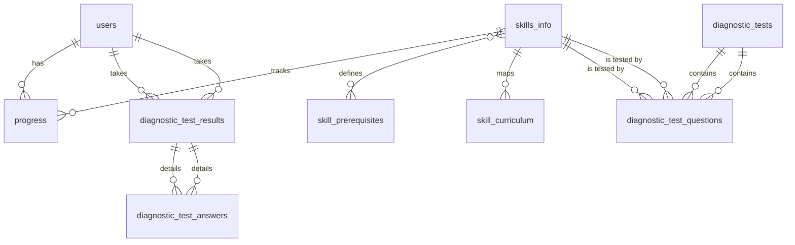

# 智學AIGC賦能平台 (Smart-Edu AIGC Platform) - 軟體設計文件 (SDD)

## 1. 系統架構

### 1.1 整體架構 (檔案結構)

```
math-master/
├── app.py              # Flask 應用程式入口
├── models.py           # 資料模型定義
├── config.py           # 配置文件
├── requirements.txt    # 相依套件
├── docs/              # 文件目錄
├── templates/         # 前端模板
├── static/           # 靜態資源
├── skills/           # 技能模組
└── tests/           # 測試目錄
```

### 1.2 技術堆疊
- **後端框架**: Flask 2.0+
- **ORM**: Flask-SQLAlchemy
- **資料庫**: SQLite (開發) / PostgreSQL (生產)
- **前端**: HTML5 + CSS3 + JavaScript
- **模板引擎**: Jinja2
- **AI 服務**: Google Gemini API
- **認證**: Flask-Login
- **測試**: pytest

## 2. 資料庫設計

### 2.1 ER 圖


### 2.2 資料表設計
- users (使用者)
  - id: INTEGER PRIMARY KEY
  - username: TEXT UNIQUE
  - password_hash: TEXT
  - email: TEXT
  - created_at: DATETIME

- skills_info (技能資訊)
  - skill_id: TEXT PRIMARY KEY
  - skill_en_name: TEXT
  - skill_ch_name: TEXT
  - category: TEXT
  - description: TEXT
  - input_type: TEXT
  - gemini_prompt: TEXT
  - consecutive_correct_required: INTEGER
  - is_active: BOOLEAN
  - order_index: INTEGER

## 3. 模組設計

### 3.1 技能模組介面
```python
class SkillModule:
    def generate(self) -> dict:
        """生成題目"""
        pass
        
    def check(self, answer: str) -> bool:
        """檢查答案"""
        pass
```

### 3.2 AI 服務介面
```python
class AIService:
    def analyze_handwriting(self, image: bytes) -> str:
        """分析手寫內容"""
        pass
        
    def evaluate_answer(self, prompt: str, answer: str) -> dict:
        """評估答案"""
        pass
```

## 4. API 設計

### 4.1 RESTful API
```
GET    /api/skills              # 取得所有技能
POST   /api/skills/<id>/generate # 生成題目
POST   /api/skills/<id>/check    # 檢查答案
GET    /api/users/<id>/progress  # 取得進度
```

### 4.2 管理介面 API
```
GET    /admin/skills           # 技能管理頁面
POST   /admin/skills          # 新增技能
PUT    /admin/skills/<id>     # 更新技能
DELETE /admin/skills/<id>     # 刪除技能
```

## 5. 安全設計

### 5.1 認證機制
- 使用 Flask-Login 管理用戶會話
- 密碼使用 bcrypt 雜湊儲存
- API 路由需要 JWT 認證

### 5.2 權限控制
```python
@roles_required('admin')
def admin_required(f):
    """管理員權限裝飾器"""
    pass
```

## 6. 測試策略

### 6.1 單元測試
```python
def test_skill_generation():
    """測試題目生成"""
    pass

def test_answer_checking():
    """測試答案檢查"""
    pass
```

### 6.2 整合測試
- 練習流程測試
- AI 服務整合測試
- 資料庫操作測試

## 7. 部署架構

### 7.1 開發環境
```bash
python -m venv .venv
.venv\Scripts\activate
pip install -r requirements.txt
flask run
```

### 7.2 生產環境
```
[Nginx] -> [Gunicorn] -> [Flask App] -> [PostgreSQL]
```

## 8. 監控與日誌

### 8.1 日誌配置
```python
import logging

logging.basicConfig(
    filename='math.log',
    level=logging.INFO,
    format='%(asctime)s - %(name)s - %(levelname)s - %(message)s'
)
```

### 8.2 性能監控
- 使用 Flask-Monitor 追蹤請求響應時間
- 資料庫查詢優化與監控
- AI 服務調用監控

## 9. 擴展性考慮

### 9.1 技能模組擴展
- 遵循統一介面
- 支援熱插拔
- 版本控制

### 9.2 資料庫擴展
- 分表策略
- 讀寫分離
- 快取機制

## 10. 相關文件
- [README.md](../README.md): 專案總覽
- [API.md](./API.md): API 文件
- [CONTRIBUTING.md](./CONTRIBUTING.md): 貢獻指南