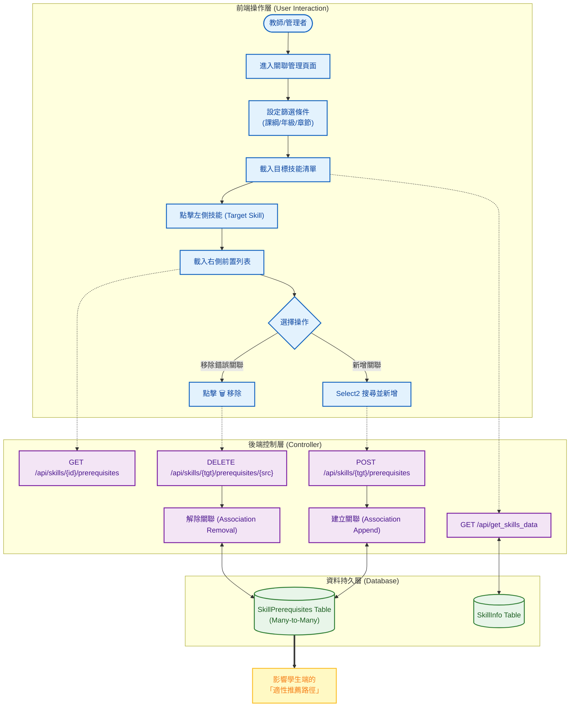

# 智學AIGC賦能平台 系統分析：知識圖譜與前置技能維護系統 (Knowledge Graph Maintenance)

**文件資訊**
* **版本**：2.1 (同步跨學制搜尋與適性化路徑概念)
* **日期**：2025-12-22
* **文件狀態**：正式版
* **負責人**：System Architect
* **相關檔案**：前端 `admin_prerequisites.html` / 後端 `routes.py`, `models.py`

---

## 1. 系統概述 (System Overview)

### 1.1 模組描述
本模組 **Knowledge Graph Maintenance** 是用於校正與優化「技能依賴關係」的視覺化管理工具。

在系統執行 `auto_build_prerequisites.py` 後，AI 已根據例題脈絡自動建立了初步的知識圖譜（預設每個技能最多 5 個前置節點）。然而，AI 可能會誤判關聯強度或遺漏跨學制的基礎（如高中技能漏掉國中對應觀念）。本介面允許資深教師以人工方式 (Human-in-the-loop)，對這些關聯進行「新增」或「移除」的微調，確保適性化推薦的準確度。

### 1.2 核心目標
1.  **圖譜校正**：移除 AI 誤判的「弱關聯」或「錯誤關聯」。
2.  **關聯補強**：手動搜尋並加入 AI 未發現的關鍵基礎技能（支援跨學制搜尋）。
3.  **學習路徑優化 (Adaptive Path)**：確保產出的知識圖譜能精確引導學生進行 **「向下診斷 (Downward Diagnosis)」**，例如當高中生「多項式除法」卡關時，系統能依據此圖譜推薦他去複習國中的「單項式運算」。

---

## 2. 系統架構與流程圖 (System Architecture)

本模組採用「主從式 (Master-Detail)」架構設計，左側為技能清單，右側為關聯編輯器。

---

## 3. 前端設計說明 (Frontend Design)

前端頁面 `admin_prerequisites.html` 整合了 **Select2** 套件，以解決從數千個技能中搜尋特定知識點的 UX 難題。

### 3.1 雙欄式佈局 (Master-Detail Layout)
* **左側 (Skill List)**：
    * 顯示篩選後的目標技能。
    * **視覺提示 (Badge)**：每個項目右側顯示一個圓形徽章。
        * **綠色 (有數字)**：表示已有 AI 生成的前置技能 (e.g., `3`)。
        * **灰色 (0)**：表示該技能目前為孤立節點 (Root Node)。
* **右側 (Editor Panel)**：
    * 顯示當前選中技能的詳細資訊 (Prompt)。
    * 列出已關聯的前置技能卡片，支援一鍵移除。
    * 底部提供「搜尋添加」工具列。

### 3.2 關鍵元件：Select2 搜尋框
* **功能**：支援「關鍵字模糊搜尋」與「跨學制搜尋」。
* **實作**：使用 `select2` 函式庫，綁定到 `<select>` 元素。
    * 當使用者輸入 "因式分解" 時，系統會即時過濾出 `jh_factorization` (國中) 與 `gh_factorization` (高中) 等選項，方便建立跨階段連結。

### 3.3 互動回饋
* **SweetAlert2**：用於刪除確認與成功提示。
* **動態 DOM 更新**：新增或刪除關聯後，**不需重整頁面**，JS 會自動更新左側列表的數字 Badge 與右側的卡片清單，提供流暢的 SPA (Single Page Application) 體驗。

---

## 4. 後端處理邏輯 (Backend Logic)

本模組主要處理多對多 (Many-to-Many) 的資料關聯操作。

### 4.1 取得關聯 API (`GET /api/skills/<skill_id>/prerequisites`)
* **邏輯**：
    1.  透過 `SkillInfo.query.get(skill_id)` 取得目標物件。
    2.  存取 `skill.prerequisites` 屬性 (SQLAlchemy ORM 自動處理 Join)。
    3.  回傳 JSON 列表：`[{id: 'jh_abc', name: '乘法公式'}, ...]`。

### 4.2 新增關聯 API (`POST /api/skills/<target_id>/prerequisites`)
* **邏輯**：
    1.  接收 JSON Body: `{ prerequisite_id: 'source_id' }`。
    2.  檢查 `source_id` 是否存在。
    3.  **防呆檢查**：防止「自己關聯自己」或「重複關聯」。
    4.  執行 `target_skill.prerequisites.append(source_skill)`。
    5.  `db.session.commit()`。

### 4.3 移除關聯 API (`DELETE /api/skills/<target_id>/prerequisites/<prereq_id>`)
* **邏輯**：
    1.  獲取雙方物件。
    2.  執行 `target_skill.prerequisites.remove(source_skill)`。
    3.  `db.session.commit()`。
    4.  回傳成功狀態，前端據此移除 DOM 元素。

---

## 5. 資料庫 Schema 關聯 (Database Schema)

本模組操作的是 `SkillInfo` 的自我參照關聯表。

| Table Name | 描述 | 關鍵欄位 (Columns) | 關聯性 |
| :--- | :--- | :--- | :--- |
| **SkillInfo** | **技能資訊表** | `skill_id` (PK) `skill_ch_name` | 核心實體 |
| **skill_prerequisites** | **關聯中介表** (Association Table) | `skill_id` (FK -> Target) `prerequisite_id` (FK -> Source) | 多對多 (Many-to-Many) 紀錄依賴方向 |

---

## 6. 實際操作與驗證 (Operation & Verification)

本節展示如何修正 AI 建構的知識圖譜，以符合實際教學邏輯。

### 6.1 情境 A：移除 AI 誤判的關聯
**情境**：AI 認為「乘法公式」的前置技能包含「求代數的值」。雖然數學上有關聯，但在高中教學現場，這兩章通常獨立教學，強行關聯會干擾學習路徑。

**步驟 1：選取目標**
在左側列表點擊 **「空間向量的座標表示」**。
* **[UI 回饋]**：右側面板載入，顯示三個卡片。

**步驟 2：檢視與移除**
看到卡片列表：
1.  **國中-求代數的值 (AI 誤判)**
2.  國中-一元一次式的運算 (保留)
3.  國中-平方差公式 (保留)

點擊「求代數的值」卡片右上角的 **[❌ 移除]** 按鈕。
系統彈出 SweetAlert2 確認視窗：「確定移除關聯嗎？」 -> 點擊 **[確定]**。

**步驟 3：驗證**
* 右側「複數平面」卡片消失。
* 左側列表 Badge 數字由 `3` 自動更新為 `2`。

---

### 6.2 情境 B：手動補強跨學制基礎
**情境**：AI 分析「高一 多項式除法」時，漏掉了國中的「單項式運算」基礎。

**步驟 1：選取目標**
在左側列表點擊 **「多項式除法原理」**。

**步驟 2：搜尋並新增**
1.  在右側底部的 **「🔍 搜尋並加入前置技能...」** 輸入框中打字：`單項式`。
2.  Select2 自動過濾出相關選項：
    * `jh_monomial_op` (國中-單項式運算)
    * `jh_poly_basic` (國中-多項式基礎)
3.  點擊選擇 `jh_monomial_op`。
4.  點擊 **[➕ 加入]** 按鈕。

**步驟 3：驗證**
* 畫面右上角彈出 Toast 提示：「✅ 已加入關聯」。
* 右側面板立即新增一張「單項式運算」的卡片。
* 此時若查詢資料庫，`skill_prerequisites` 表中已成功寫入 `(gh_poly_division, jh_monomial_op)` 的紀錄。