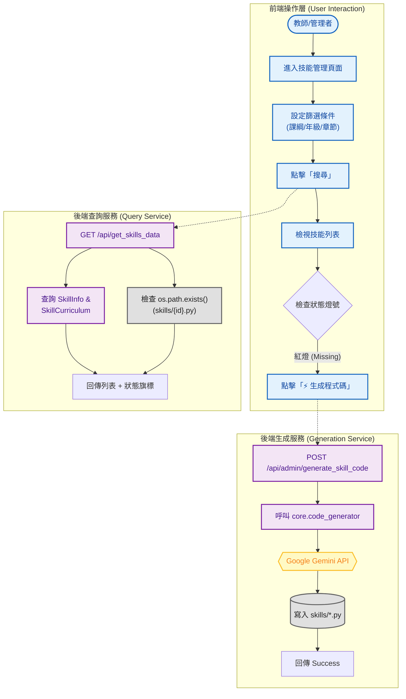

# 智學 Copilot 系統分析：技能管理與代碼生成控制台 (Skill Management Console)

**文件資訊**
* **版本**：1.0
* **日期**：2025-12-08
* **文件狀態**：正式版
* **負責人**：System Architect
* **相關檔案**：前端 `admin_skills.html` / 後端 `routes.py`, `core/code_generator.py`

---

## 1. 系統概述 (System Overview)

### 1.1 模組描述
本模組 **Skill Management Console** 提供了全系統技能資產的總覽儀表板。
在教材匯入與結構校正後，系統需為每個 `Skill ID` 生成對應的 Python 出題腳本。本介面主要用於**監控生成狀態**（是否缺檔）與**執行單點修復**。當發現某個技能的程式碼缺失或邏輯有誤時，管理者可透過此介面呼叫 AI 即時重新生成。

### 1.2 核心目標
1.  **狀態可視化**：即時掃描檔案系統，以綠燈/紅燈顯示每個技能是否已有對應的 `.py` 檔案。
2.  **單點 AI 生成**：針對特定技能觸發 `auto_generate_skill_code`，進行程式碼修復或重建。
3.  **元數據檢視**：快速查看技能的 Prompt 描述、對應的章節位置。

---

## 2. 系統架構與流程圖 (System Architecture)

本模組整合了資料庫查詢與檔案系統掃描，並作為觸發 AI 生成的 GUI 入口。

---

## 3. 前端設計說明 (Frontend Design)

前端頁面 `admin_skills.html` 整合了 **SweetAlert2** 提供優雅的互動體驗，並使用動態 DOM 操作來渲染大量資料。

### 3.1 狀態儀表板 (Status Dashboard)
* **檔案狀態燈號**：
    * **✅ 綠色打勾 (bi-check-circle-fill)**：表示 `skills/{skill_id}.py` 檔案存在，該題型可正常運作。
    * **❌ 紅色叉叉 (bi-x-circle-fill)**：表示檔案缺失 (Missing)，需要執行生成。
* **Prompt 狀態**：顯示該技能是否已設定 AI 出題用的 Prompt 描述。

### 3.2 互動操作元件
* **搜尋與篩選**：沿用標準的四層連動下拉選單 (Cascading Dropdowns)，方便精確定位到某一小節的技能。
* **生成按鈕 (Regenerate Button)**：
    * 綁定 `onclick="regenerateSkill('skill_id')"`。
    * 點擊後顯示 Loading Spinner。
    * 成功後彈出 **SweetAlert2** 提示「✨ 生成成功」，並自動重整頁面。

---

## 4. 後端處理邏輯 (Backend Logic)

### 4.1 技能資料查詢 API (`/api/get_skills_data`)
* **功能**：提供前端表格所需的完整資訊，包含即時的檔案存在檢查。
* **邏輯流**：
    1.  接收篩選參數 (`curriculum`, `grade`, ...)。
    2.  查詢 `SkillInfo` 資料表，並 Join `SkillCurriculum` 以取得章節資訊。
    3.  **關鍵步驟**：遍歷查詢結果，對每個 `skill_id` 執行 `os.path.exists(f"skills/{skill_id}.py")`。
    4.  將 `has_file` (Boolean) 欄位注入回傳的 JSON 中。

### 4.2 單點生成 API (`/api/admin/generate_skill_code`)
* **功能**：接收前端指令，即時呼叫 AI 生成單一檔案。
* **邏輯流**：
    1.  接收 POST 請求中的 `skill_id`。
    2.  呼叫核心模組 `auto_generate_skill_code(skill_id)`。
    3.  該函式會：
        * 讀取 `SkillInfo`。
        * 組裝 Prompt。
        * 呼叫 Gemini。
        * 驗證 AST 語法。
        * 寫入檔案。
    4.  若生成成功，回傳 `{success: true}`；若失敗 (如 AI 拒絕或語法錯誤)，回傳錯誤訊息。

---

## 5. 資料庫 Schema 關聯 (Database Schema)

| Table Name | 關鍵欄位 | 用途說明 |
| :--- | :--- | :--- |
| **SkillInfo** | `skill_id` (PK) `description` `input_type` | **核心資料**。`description` 是 AI 生成程式碼最重要的依據。 |
| **SkillCurriculum** | `chapter` `section` | **篩選依據**。讓使用者能透過章節找到技能。 |
| **File System** | `skills/{skill_id}.py` | **實體資產**。本介面雖不存入 DB，但會即時檢查此路徑。 |

---

## 6. 實際操作與驗證 (Operation & Verification)

本節展示如何使用此介面監控系統健康度，並修復缺失的程式碼。

### 6.1 情境：發現並修復缺失的題庫
**情境描述**：教師在「10年級 一次與二次函數」單元中，發現「函數的概念」這個技能雖然有資料，但無法出題（檔案遺失）。

**步驟 1：定位問題技能**
在篩選列選擇：`普高` > `10年級` > `數學1` > `單元9 一次與二次函數`，點擊 **[🔍 搜尋]**。

**[Web UI 畫面模擬]**

**步驟 2：執行 AI 修復**
1.  點擊 `gh_FunctionConcept` 右側的 **[重建Code]** 按鈕。
2.  **系統回饋**：按鈕變為旋轉的 Loading圖示，顯示「生成中...」。後端正在呼叫 Gemini API 撰寫 Python 程式碼。

**步驟 3：成功驗證**
約 10-20 秒後，畫面彈出 SweetAlert2 視窗。

**[SweetAlert2 彈窗模擬]**

點擊「太棒了！」後，頁面自動重整，該技能的狀態燈號由 **❌** 轉為 **✅**，表示修復完成，現在學生已可以練習此題型。