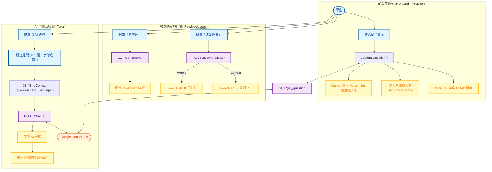

# 系統分析文件：智慧適性化練習介面 (Intelligent Adaptive Practice Interface)

**文件資訊**
* **版本**：2.0 (前端互動與 AI 整合深度分析)
* **日期**：2025-12-09
* **文件狀態**：正式版
* **負責人**：System Architect
* **相關檔案**：前端 `index.html` / 後端 `routes.py`, `ai_analyzer.py`

---

## 1. 系統概述 (System Overview)

### 1.1 模組描述
本模組是學生進行數學學習的核心場域。它突破了傳統「單向刷題」的限制，打造了一個 **「多模態 (Multimodal) 互動學習環境」**。
透過整合 **MathJax** (數學渲染)、**Dynamic Iframe** (動態視覺化) 與 **AI Chatbot** (即時輔導)，本介面實現了「題目、圖形、家教」三位一體的學習體驗。


### 1.2 核心目標 (競賽亮點)
1.  **沈浸式解題**：左側算式、右側圖形，數形結合 (Visual-Math Integration) 幫助學生理解抽象概念。
2.  **AI 上下文輔導**：內建 AI 助教，能「看懂」學生當前正在做的題目，提供針對性的引導，而非通用回答。
3.  **動態圖解生成**：系統能根據題目參數，即時生成對應的函數圖形或幾何圖示 (由後端 AI 或 Python 繪圖庫產出 HTML 片段)。

---

## 2. 系統架構與流程圖 (System Architecture)

本模組展示了前端如何協調「題目資料流」、「視覺化資料流」與「AI 對話資料流」。



---

## 3. 前端關鍵功能詳解 (Frontend Features)

### 3.1 數學渲染引擎 (MathJax Integration)
* **技術**：使用 `MathJax 3.x`。
* **功能**：將後端傳來的 LaTeX 字串 (如 `\frac{-b \pm \sqrt{b^2-4ac}}{2a}`) 渲染為漂亮的數學排版。
* **程式碼亮點**：
    ```javascript
    window.MathJax = {
        tex: { inlineMath: [['$', '$'], ['\\(', '\\)']] }, // 支援錢字號作為公式邊界
        svg: { fontCache: 'global' }
    };
    ```
    確保了無論是題目敘述、選項還是 AI 的回答，數學符號都能完美顯示。

### 3.2 數形結合視窗 (Dynamic Visualization Iframe)
這是本系統最創新的設計。右側並非靜態圖片，而是一個 `<iframe>` 容器。
* **運作原理**：
    1.  後端 Python 程式碼 (例如利用 `matplotlib` 生成 SVG，或生成 `Desmos/GeoGebra` 的 API code) 產生一段 HTML 字串 (`visual_html`)。
    2.  前端接收後，直接寫入 Iframe：
        ```javascript
        const iframeDoc = iframe.contentDocument || iframe.contentWindow.document;
        iframeDoc.write(data.visual_html);
        ```
* **教學效益**：學生在計算「二次函數頂點」時，右側能即時顯示該拋物線的圖形，實現「看圖解題」的直觀教學。

### 3.3 動態輸入介面 (Adaptive Input)
前端根據後端回傳的 `input_type` 自動切換 UI：
* **`math_input`**：提供數學符號虛擬鍵盤（未來擴充）。
* **`radio`**：選擇題模式。
* **`checkbox`**：多選題模式。
* **`text`**：一般填充題。

---

## 4. AI 串連與輔助 (AI Integration)

`index.html` 中的 Chatbot 不僅僅是一個聊天室，它是**具備上下文感知 (Context-Aware)** 的教學代理人。

### 4.1 上下文注入 (Context Injection)
當學生提問時，JS 不只傳送學生的問題，還會偷偷夾帶「當前題目資訊」：
```javascript
// index.html 中的 sendChat 函式
const response = await fetch('/chat_ai', {
    method: 'POST',
    body: JSON.stringify({
        question: userQuestion, // 學生問：這題怎麼算？
        context: currentContext // 系統夾帶：題目是 x^2-1=0, 技能是 gh_poly...
    })
});
```
* **效益**：AI 不需要學生重新複製題目，就能直接回答「這題是差平方公式的應用...」。

### 4.2 蘇格拉底式引導 (Socratic Guidance)
後端的 Prompt 設計讓 AI 扮演「引導者」而非「解題機」。
* **情境**：學生問「答案是多少？」
* **AI 回應**：AI 不會給答案，而是回傳：「我們先觀察一下係數，你覺得可以用十字交乘法嗎？」
* **Follow-up Prompts**：介面下方會自動生成建議追問按鈕（如「提示第一步」、「顯示相關公式」），降低學生提問的心理門檻。

---

## 5. 實際操作情境 (User Journey)

### 情境：高一學生練習「多項式除法」

**步驟 1：載入題目**
* 畫面左側出現題目：$f(x) = x^3 - 2x + 1$，求 $f(x)$ 除以 $(x-1)$ 的餘式。
* **圖形化解答**：畫面右側 Iframe 載入動態圖表，顯示 $y=x^3-2x+1$ 的曲線，並標示出 $x=1$ 時的點 $(1, 0)$。學生直觀看到餘式為 0。

**步驟 2：嘗試解題**
* 學生試圖用長除法計算，但在係數運算上卡住了。

**步驟 3：求助 AI**
* 學生點擊右下角 **[🤖 AI 助教]** 圖示。
* 輸入：「我長除法算錯了，有別的方法嗎？」
* AI 讀取 Context 後回答：「這題可以使用 **餘式定理** 喔！令除式為 0，即 $x=1$，代入原式計算看看。」

**步驟 4：輸入答案與回饋**
* 學生在輸入框填入 `0`，按 **[送出答案]**。
* 系統彈出 **SweetAlert2** 綠色視窗：「🎉 答對了！連續答對 3 題，即將晉級！」。
* 系統自動載入下一題（難度動態提升）。

---

## 6. 系統技術亮點總結

1.  **Hybrid Rendering**：結合 Server-side 的 Python 運算能力（生成題目與圖形程式碼）與 Client-side 的 MathJax 渲染能力，達到最佳效能與顯示效果。
2.  **No-Refresh Experience**：全站採用 AJAX (Fetch API) 與使用者互動，答題、看詳解、換題皆無須重整頁面，體驗流暢如 App。
3.  **Adaptive Visuals**：圖形不是死板的 JPG，而是由程式碼生成的動態內容，能完全對應每一次隨機生成的題目參數，這是傳統題庫無法做到的。