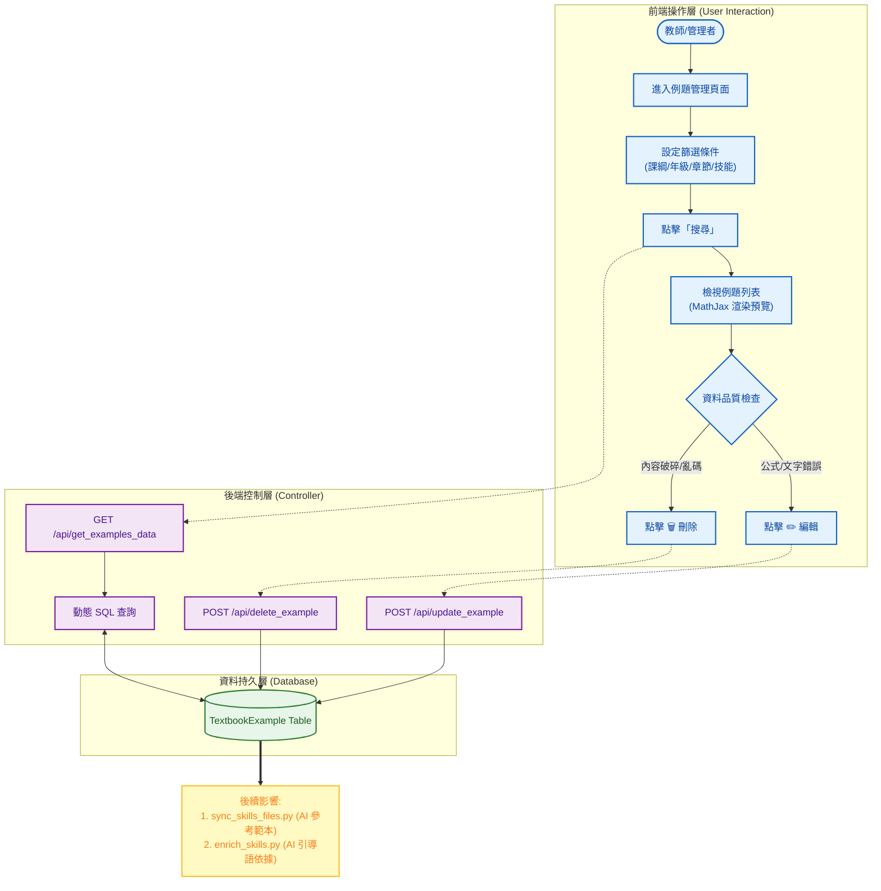

# 系統分析文件：課本例題維護與清洗系統 (Textbook Example Maintenance)

**文件資訊**
* **版本**：1.0
* **日期**：2025-12-08
* **文件狀態**：正式版
* **負責人**：System Architect
* **相關檔案**：前端 `admin_examples.html` / 後端 `routes.py`, `models.py`

---

## 1. 系統概述 (System Overview)

### 1.1 模組描述
本模組 **Example Maintenance** 是 AI 教材匯入流程後的 **「資料清洗 (Data Cleaning)」** 介面。
在前置步驟中，`Textbook Importer` 雖然能自動從 PDF/Word 提取題目，但受限於 OCR 技術限制，常會出現「斷行錯誤」、「數學符號遺漏」或「截圖不完整」的情況。本系統提供一個支援 LaTeX 渲染的介面，讓教師在 AI 進行 **「題庫程式碼生成 (Code Gen)」** 之前，先行檢視並修正這些例題資料。

### 1.2 核心目標
1.  **資料除錯**：修正 OCR 識別錯誤的數學公式 (如 `x2` -> `x^2`)。
2.  **垃圾清除**：刪除內容破碎、無法理解或重複的例題，避免誤導後續的 AI 模型。
3.  **關聯修正**：確保例題掛載在正確的 `Skill ID` 下，作為 Few-Shot Learning 的高品質範本。

---

## 2. 系統架構與流程圖 (System Architecture)

本模組位於資料流的中游，是「匯入」與「生成」之間的品質防火牆。

---

## 3. 前端設計說明 (Frontend Design)

前端頁面 `admin_examples.html` 的設計重點在於 **「數學公式的正確呈現」**。

### 3.1 數學渲染引擎 (MathJax Integration)
* **核心技術**：引入 `MathJax 3.0`。
* **功能**：自動將資料庫中的 LaTeX 字串 (如 `$\frac{-b \pm \sqrt{b^2-4ac}}{2a}$`) 渲染為漂亮的數學公式。
* **觸發時機**：
    * 頁面載入時。
    * AJAX 搜尋返回後，手動呼叫 `MathJax.typesetPromise()` 重繪表格內容。

### 3.2 互動式編輯 Modal
* **欄位設計**：
    * **題目內容 (`textarea`)**：支援多行輸入，用於修補被 OCR 截斷的長題目。
    * **詳解 (`textarea`)**：提供 AI 參考的解題步驟。
    * **關聯技能 (`select`)**：若 AI 分類錯誤，可在此重新指派給正確的技能 ID。

### 3.3 資料過濾器
* **層級篩選**：同樣採用四層連動下拉選單 (Curriculum -> Grade -> Volume -> Chapter)。
* **技能連動**：選擇章節後，會進一步列出該章節下的所有 `Skill ID`，方便針對特定觀念進行批次檢查。

---

## 4. 後端處理邏輯 (Backend Logic)

### 4.1 例題查詢 API (`GET /api/get_examples_data`)
* **邏輯**：
    1.  接收篩選參數。
    2.  查詢 `TextbookExample` 表，並 Join `SkillInfo` 以顯示技能名稱。
    3.  **排序**：預設依 `id` 或 `source_page` 排序，還原課本順序。
    4.  回傳 JSON，前端接收後動態生成 HTML Table 並觸發 MathJax。

### 4.2 例題更新 API (`POST /api/update_example`)
* **邏輯**：
    1.  接收 `id`, `problem_text`, `detailed_solution`, `skill_id` 等欄位。
    2.  驗證資料完整性。
    3.  更新資料庫紀錄。
    4.  **重要**：更新後，這個例題將成為後續 AI 生成程式碼的「黃金樣本 (Gold Standard)」。

### 4.3 例題刪除 API (`POST /api/delete_example`)
* **邏輯**：
    1.  接收 `id`。
    2.  執行實體刪除 (Physical Delete)。
    3.  **目的**：徹底移除垃圾資料，防止 AI 在 `sync_skills_files.py` 階段讀取到錯誤的題目描述，導致生成的 Python 程式碼邏輯崩壞。

---

## 5. 資料庫 Schema 關聯 (Database Schema)

本模組主要維護 `TextbookExample` 資料表。

| Table Name | 描述 | 關鍵欄位 (Columns) | 用途 |
| :--- | :--- | :--- | :--- |
| **TextbookExample** | **課本例題表** | `id` (PK) `skill_id` (FK): 關聯技能 `problem_text`: 題目 (含 LaTeX) `detailed_solution`: 詳解 `source_description`: 來源 (如: P.15 例題2) | AI 生成程式碼時的 **Few-Shot Context**。 |
| **SkillInfo** | **技能資訊表** | `skill_id`: 技能代碼 `skill_ch_name`: 技能名稱 | 用於分類與篩選。 |

---

## 6. 實際操作與驗證 (Operation & Verification)

本節展示如何使用此介面清洗資料，確保下游的 AI 生成品質。

### 6.1 情境 A：刪除破碎或無意義的題目
**情境**：匯入時，AI 將頁尾的廣告詞「版權所有 翻印必究」誤判為一道數學題。

**步驟 1：識別垃圾資料**
管理者在列表中看到一筆資料：
* **題目**：`版權所有 翻印必究 www.publisher.com`
* **技能**：`gh_poly_add` (被錯誤歸類)

**步驟 2：執行刪除**
1.  點擊該列右側的 **[🗑️ 刪除]** 按鈕。
2.  確認視窗點擊 **[確定]**。
3.  **效益**：避免 AI 在生成「多項式加法」程式碼時，誤以為題目要包含版權宣告文字。

---

### 6.2 情境 B：修復 OCR 導致的 LaTeX 錯誤
**情境**：AI 成功提取了題目，但將「二次方」符號識別錯誤，導致 MathJax 無法渲染。
* **原始資料**：`若 f(x) = x2 + 3x + 1，求 f(1)` (將 `^2` 誤判為 `2`)。

**步驟 1：檢視問題**
在列表中發現該題目的數學式顯示異常，沒有呈現上標效果。

**步驟 2：編輯修正**
1.  點擊 **[✏️ 編輯]** 按鈕。
2.  在 Modal 中將 `problem_text` 修改為：`若 $f(x) = x^2 + 3x + 1$，求 $f(1)$`。
3.  點擊 **[儲存]**。

**步驟 3：驗證渲染**
畫面自動重整，MathJax 成功渲染出漂亮的 $f(x) = x^2 + 3x + 1$。
**效益**：後續 AI 在參考此例題撰寫 Python 程式碼時，能正確理解這是「二次多項式」，而非一次多項式。

---

### 6.3 影響鏈驗證 (Impact Chain Verification)
完成資料清洗後，教師執行後台腳本 `scripts/sync_skills_files.py`。

* **Before (清洗前)**：AI 讀到錯誤例題 `x2`，生成的 Python 程式碼可能寫成 `return x * 2 + 3 * x` (錯誤邏輯)。
* **After (清洗後)**：AI 讀到正確 LaTeX `$x^2$`，生成的 Python 程式碼正確寫成 `return x ** 2 + 3 * x`。

**結論**：`admin_examples.html` 的操作直接決定了自動出題系統的**準確度**與**可用性**。