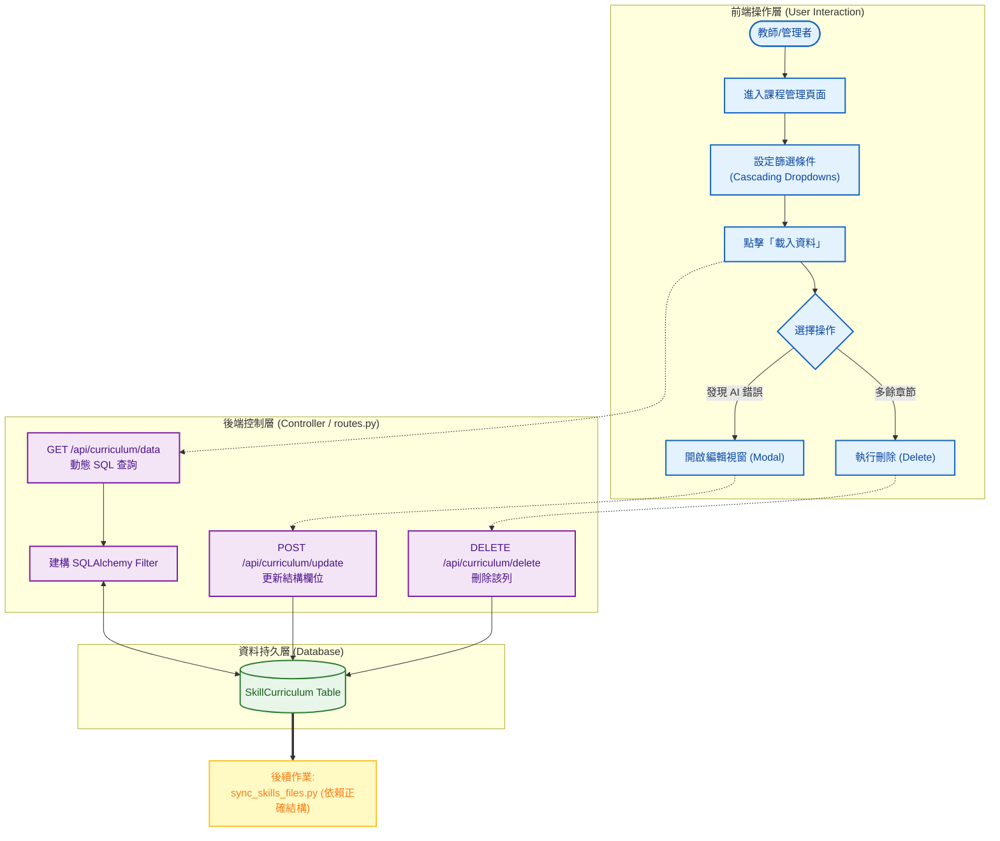

# 系統分析文件：課程結構維護與校正系統 (Curriculum Maintenance)

**文件資訊**
* **版本**：1.0
* **日期**：2025-12-08
* **文件狀態**：正式版
* **負責人**：System Architect
* **相關檔案**：前端 `admin_curriculum.html` / 後端 `routes.py`

---

## 1. 系統概述 (System Overview)

### 1.1 模組描述
本模組 **Curriculum Maintenance** 是 AI 教材匯入流程中的關鍵「人工校正 (Human-in-the-loop)」環節。

當 `Textbook Importer` 完成 PDF/Word 解析後，AI 提取的章節結構可能存在雜訊（如：OCR 錯誤、章節層級誤判、重複標題）。本系統提供一個可視化的 CRUD 介面，讓教師或管理者在執行後續自動化作業（如生成題庫程式碼、建立知識圖譜）之前，先行檢視並修正資料庫中的課綱結構，確保「垃圾不進，垃圾不出 (Garbage In, Garbage Out)」。

### 1.2 核心目標
1.  **結構清洗**：修正 AI 解析出的錯誤章節名稱或順序 (例如：`數與弐` -> `數與式`)。
2.  **層級調整**：重新定義「章 (Chapter)」與「節 (Section)」的隸屬關係。
3.  **資料完整性確保**：作為防火牆，防止錯誤的 Metadata 流入後端的自動出題系統 (`sync_skills_files.py`)。

---

## 2. 系統架構與流程圖 (System Architecture)

本模組位於資料流的中游，介於「資料匯入」與「內容生成」之間。

---

## 3. 前端設計說明 (Frontend Design)

前端頁面 `admin_curriculum.html` 採用 **Bootstrap 5** 與 **Vanilla JavaScript (ES6+)** 開發，強調操作的流暢性與即時回饋。

### 3.1 連動式篩選器 (Cascading Selects)
為了解決課綱結構複雜的問題，前端實作了四層連動下拉選單，避免使用者在茫茫大海中尋找資料。
* **邏輯**：
    1.  選擇 **「課綱」** -> 觸發 API -> 更新 **「年級」** 選單。
    2.  選擇 **「年級」** -> 觸發 API -> 更新 **「冊次」** 選單。
    3.  選擇 **「冊次」** -> 觸發 API -> 更新 **「章節」** 選單。
* **程式碼參考**：`populateSelect(target, url, ...)` 函式負責非同步載入選項並管理 Loading 狀態。

### 3.2 資料表格與互動 (Interactive Data Table)
* **呈現方式**：以條列式表格展示查詢結果，包含 `ID`, `課綱`, `年級`, `冊次`, `章節`, `小節`, `對應技能`。
* **操作按鈕**：每列資料右側提供「✏️ 編輯」與「🗑️ 刪除」按鈕。
    * **編輯**：點擊後觸發 `openEditModal(item)`，將該列的 JSON 資料填充至 Modal 表單中。
    * **刪除**：點擊後觸發 `deleteCurriculum(id)`，彈出 `confirm` 確認視窗。

### 3.3 編輯視窗 (Edit Modal)
* **功能**：提供表單介面，允許使用者修改 AI 誤判的 `chapter` (章節名稱) 或 `section` (小節名稱)。
* **防呆機制**：所有欄位皆設為 `required`，確保結構完整性。

---

## 4. 後端處理邏輯 (Backend Logic)

後端 API 邏輯主要位於 `routes.py`，使用 Flask Blueprint 處理路由與 SQLAlchemy 進行 ORM 操作。

### 4.1 資料查詢 API (`/api/get_curriculum_data`)
* **Method**: `GET`
* **邏輯**：
    1.  接收 Query String (`curriculum`, `grade`, `volume`, `chapter`, `section`)。
    2.  使用 `SQLAlchemy` 動態建立過濾條件 (`filter_conditions`)。
        * *程式碼邏輯*：若 `request.args.get('chapter')` 存在且不為空，則 `query = query.filter(SkillCurriculum.chapter == value)`。
    3.  執行查詢並透過 `join` 關聯 `SkillInfo` (取得技能中文名稱)。
    4.  回傳 JSON 陣列。

### 4.2 資料更新 API (`/api/update_curriculum`)
* **Method**: `POST`
* **邏輯**：
    1.  接收 JSON Payload (`id`, `curriculum`, `grade`, `volume`, `chapter`, `section`)。
    2.  透過 `id` 鎖定 `SkillCurriculum` 物件。
    3.  更新欄位值並執行 `db.session.commit()`。
    4.  若發生錯誤 (如 ID 不存在)，回傳 400/500 錯誤代碼與訊息。

### 4.3 資料刪除 API (`/api/delete_curriculum`)
* **Method**: `POST` / `DELETE`
* **邏輯**：
    1.  接收 `id`。
    2.  執行 `SkillCurriculum.query.get(id)`。
    3.  執行 `db.session.delete(item)` 與 `commit()`。

---

## 5. 資料庫 Schema 關聯 (Database Schema)

本模組主要維護 `SkillCurriculum` 資料表，該表定義了所有教材的骨架。

| Table Name | 描述 | 關鍵欄位 (Columns) | 關聯性 |
| :--- | :--- | :--- | :--- |
| **SkillCurriculum** | **課綱結構表** (本模組維護對象) | `id` (PK) `curriculum` (String): 課綱版本 `grade` (String): 年級 `volume` (String): 冊次 `chapter` (String): 章名 `section` (String): 節名 `skill_id` (FK): 關聯的技能 | 多對一 (Many-to-One)  -> `SkillInfo` |
| **SkillInfo** | **技能資訊表** | `skill_id` (PK) `skill_ch_name`: 技能中文名 | 被 `SkillCurriculum` 參照 |

---

## 6. 實際操作與驗證 (Operation & Verification)

本節展示如何使用此介面修復 AI 匯入後的結構錯誤，確保後續生成的準確性。

### 6.1 情境 A：修復 AI 的 OCR 錯字
**情境**：AI 將「第一章 數與式」錯誤辨識為「第一章 數與弐」。

**步驟 1：篩選目標資料**
管理者在篩選列依序選擇：`普高` > `10年級` > `數學1`，點擊 **[🔍 載入資料]**。

**[Web UI 畫面模擬]**

**步驟 2：執行編輯**
1.  點擊 ID 308 右側的 **[✏️]** 按鈕。
2.  修改內容。
3.  點擊 **[保存變更]**。

**步驟 3：結果驗證**
系統提示「更新成功」，表格自動刷新，顯示正確的章節名稱。

---

### 6.2 情境 B：刪除 AI 誤判的多餘結構
**情境**：AI 將 PDF 的「版權宣告頁」或「廣告頁」誤判為一個獨立章節。

**步驟 1：識別問題**
在列表中發現一筆資料：`章節: 版權宣告`，且無對應有效的技能 ID 或技能為空。

**步驟 2：執行刪除**
1.  點擊該列右側的 **[🗑️]** 按鈕。
2.  瀏覽器彈出確認視窗：「確定要刪除 ID: 999 嗎？此動作無法復原。」
3.  點擊 **[確定]**。

**步驟 3：後續影響**
執行後台腳本 `scripts/sync_skills_files.py` 時，系統將**不會**為這個錯誤的章節生成無效的 Python 檔案，保持了專案結構的整潔。