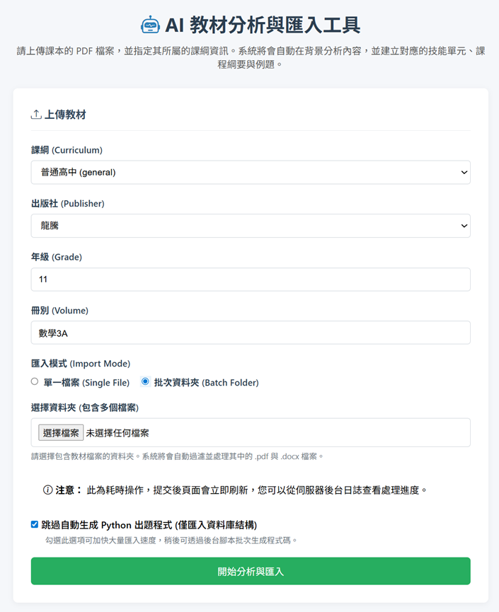

# 系統分析文件：AI 輔助教材分析與匯入系統

**版本**：1.2 (修正格式與 UI 圖示)  
**日期**：2025-12-07  
**文件狀態**：正式版  
**負責人**：System Architect  
**相關檔案**：前端 `textbook_importer.html` / 後端 `textbook_processor.py`

---

## 1. 系統概述 (System Overview)

本系統為一套「AI 輔助教材分析與匯入系統」，旨在自動化處理教學資源的數位化流程。系統透過前端介面接收使用者的教科書檔案（PDF/Word），經由後端進行光學字元辨識（OCR）、格式轉換與清洗，並整合 Google Gemini AI 進行內容結構化分析，最終將章節、技能點與例題存入資料庫，以支援後續的智慧教學應用。

---

## 2. 系統架構與流程圖 (System Architecture)

本系統採用分層架構設計，確保各模組職責分離。以下流程圖展示從「使用者上傳」到「資料持久化」的完整數據流向。

```mermaid
graph TD
    %% --- 定義樣式 (Class Definitions) ---
    classDef userAction fill:#e3f2fd,stroke:#1565c0,stroke-width:2px,color:#0d47a1;
    classDef systemProcess fill:#f3e5f5,stroke:#7b1fa2,stroke-width:2px,color:#4a148c;
    classDef dbData fill:#e8f5e9,stroke:#2e7d32,stroke-width:2px,color:#1b5e20;
    classDef extAPI fill:#fff3e0,stroke:#ef6c00,stroke-width:2px,stroke-dasharray: 5 5,color:#e65100;

    %% --- 1. 前端層 (Frontend Layer) ---
    subgraph "前端介面層 (User Interface)"
        direction TB
        Start(["使用者進入系統"]) --> SetMeta["設定 Metadata<br/>(課綱/出版社/年級/冊次)"]
        SetMeta --> ChooseMode{"選擇匯入模式"}
        ChooseMode -- "模式 A: 單一檔案" --> InputFile["上傳 .pdf / .docx"]
        ChooseMode -- "模式 B: 批次資料夾" --> InputFolder["上傳資料夾 (webkitdirectory)"]
        InputFile --> SkipCode["勾選: 是否跳過程式碼生成?"]
        InputFolder --> SkipCode
        SkipCode --> SubmitAction["點擊「開始分析」 (POST)"]
    end

    %% --- 2. 後端控制層 (Controller Layer) ---
    subgraph "後端路由與檢核 (Controller)"
        direction TB
        SubmitAction --> FlaskRoute["Flask 接收 Request"]
        FlaskRoute --> FilterName{"檔名過濾"}
        FilterName -- "開頭為 ~$" --> IgnoreFile(["忽略暫存檔"])
        FilterName -- "正常檔名" --> CheckExt{"副檔名分流"}
    end

    %% --- 3. 核心處理層 (Processing Layer) ---
    subgraph "核心處理層 (Core Processing)"
        direction TB
        %% PDF 分支
        CheckExt -- ".pdf" --> PyMuPDF["PyMuPDF: 提取純文字"]
        PyMuPDF --> PyTesseract["PyTesseract: 頁面截圖 OCR"]
        
        %% Word 分支
        CheckExt -- ".docx" --> Pypandoc["Pypandoc: 轉為 Markdown<br/>(保留 LaTeX)"]
        Pypandoc --> CheckMedia{"檢查 Media 資源"}
        CheckMedia -- ".wmf / .emf" --> WandConvert["Wand: 向量圖轉 .png"]
        CheckMedia -- "一般圖片" --> ImgOCR["針對圖片執行 OCR"]
        WandConvert --> ImgOCR
        ImgOCR --> CleanPandoc["clean_pandoc_output:<br/>清洗雙重上標/雜訊"]
        
        %% 匯流
        PyTesseract --> MergeData["整合文字與圖片內容"]
        CleanPandoc --> MergeData
    end

    %% --- 4. AI 服務層 (AI Service Layer) ---
    subgraph "AI 分析與結構化 (AI Service)"
        direction TB
        MergeData --> SelectPrompt["選擇 System Prompt<br/>(國中/普高/通用)"]
        SelectPrompt --> GeminiAPI["呼叫 Google Gemini API"]
        GeminiAPI --> SanitizeJSON["_sanitize_and_parse_json:<br/>修復 JSON 格式錯誤"]
        SanitizeJSON --> FixLaTeX["fix_common_latex_errors:<br/>修復數學符號 (sin -> \sin)"]
    end

    %% --- 5. 資料層 (Data Layer) ---
    subgraph "資料持久化 (Database)"
        direction TB
        FixLaTeX --> WriteDB[("寫入 SQLite/DB")]
        WriteDB --> Tbl_Skill[("SkillInfo 表")]
        WriteDB --> Tbl_Curriculum[("SkillCurriculum 表")]
        WriteDB --> Tbl_Example[("TextbookExample 表")]
    end

    %% --- 套用樣式 (Apply Styles) ---
    class Start,SetMeta,ChooseMode,InputFile,InputFolder,SkipCode,SubmitAction userAction;
    class FlaskRoute,FilterName,CheckExt,PyMuPDF,PyTesseract,Pypandoc,WandConvert,ImgOCR,CleanPandoc,MergeData,SelectPrompt,SanitizeJSON,FixLaTeX,CheckMedia systemProcess;
    class WriteDB,Tbl_Skill,Tbl_Curriculum,Tbl_Example dbData;
    class GeminiAPI extAPI;
```



---

## 3. 前端設計說明 (Frontend Design)

前端頁面 `textbook_importer.html` 採用 **Bootstrap 5** 進行響應式佈局，並透過 **Vanilla JavaScript** 控制互動邏輯，確保使用者能直觀地配置匯入參數。

### 3.1 使用者介面設計 (UI Layout)
下圖為系統實際操作畫面，包含課綱設定、匯入模式切換與進階選項：



**介面元件詳細說明**：

1.  **教材 Metadata 設定 (Metadata Configuration)**：
    * **課綱 (Curriculum)**：下拉選單，支援「普通高中 (general)」、「國中」、「技高」等選項，這將決定後端 AI 分析時使用的 System Prompt 版本。
    * **出版社 (Publisher)**：下拉選單（如：康軒、龍騰、翰林），用於標記資料來源。
    * **年級 (Grade)**：文字輸入框，支援數字格式（Placeholder 提示：例如 10）。
    * **冊次 (Volume)**：文字輸入框，支援英數混合（Placeholder 提示：例如 數學3A）。

2.  **匯入模式 (Import Mode)**：
    * **單一檔案 (Single File)**：預設模式，適用於上傳個別 `.pdf` 或 `.docx` 檔案。
    * **批次資料夾 (Batch Folder)**：切換後支援 `webkitdirectory` 屬性，允許使用者選取整層資料夾，適合大量教材的一次性遷移。

3.  **進階控制 (Advanced Controls)**：
    * **跳過自動生成 Python 出題程式**：Checkbox 選項。
        * **功能**：若勾選此項，後端僅將內容寫入 `SkillInfo` 與 `TextbookExample` 資料庫，**不觸發**耗時的 `auto_generate_skill_code` 函式。
        * **用途**：當進行大量歷史資料匯入，且暫時不需要立即生成對應的出題腳本時，勾選此項可顯著加快匯入速度。

4.  **操作回饋 (Feedback)**：
    * 介面包含提示圖標 (ⓘ)，明確告知使用者此為耗時操作。
    * 點擊綠色 **「開始分析與匯入」** 按鈕後，系統將鎖定介面並顯示讀取狀態，使用者可至後端日誌 (Logs) 查看即時進度。

### 3.2 模式切換邏輯 (Mode Switching)
系統透過 JavaScript 監聽 Radio Button (`Import Mode`) 事件，動態切換 DOM 顯示與驗證規則：
* **選擇「單一檔案」時**：顯示標準 `<input type="file" accept=".pdf,.docx,.doc">`，隱藏資料夾輸入框，設定單檔欄位為 `required`。
* **選擇「批次資料夾」時**：顯示 `<input type="file" webkitdirectory>`，隱藏單檔輸入框，設定資料夾欄位為 `required`。
* **資料清洗**：切換模式時自動清空非當前模式的 `value`，防止送出錯誤的空值或多餘檔案。

---

## 4. 後端處理邏輯 (Backend Logic)

後端核心 `textbook_processor.py` 基於 **Flask** 框架，針對不同檔案格式實作了差異化的 ETL 流程。

### 4.1 檔案前處理與分流
1.  **檔名過濾**：自動過濾以 `~$` 開頭的 Word 暫存檔，避免程式錯誤。
2.  **格式分流**：
    * **PDF 處理**：
        * 使用 `PyMuPDF (fitz)` 快速提取文字層。
        * 使用 `PyTesseract` 針對頁面截圖進行 OCR，以補全掃描檔或複雜排版中的遺漏文字。
    * **Word (.docx) 處理**：
        * 使用 `Pypandoc` 將文件轉換為 Markdown 格式，參數設定保留 LaTeX 公式結構。
        * **影像處理**：引入 `Wand` 將舊式向量圖 (`.wmf`, `.emf`) 轉換為 `.png`，解決 OCR 引擎不支援的問題。
        * **格式清洗 (`clean_pandoc_output`)**：使用 Regex 移除轉檔產生的雜訊（如雙重上標 `^`）並標準化行內公式邊界。

### 4.2 AI 分析與資料清洗
* **Prompt 工程**：根據使用者選擇的「課綱類型」動態載入對應的 System Prompt（例如：國中版強調主題拆分，普高版強調觀念整合）。
* **JSON 容錯解析 (`_sanitize_and_parse_json`)**：針對 LLM 常見的輸出錯誤（如 Markdown 標記殘留、引號未閉合）進行多階段修復與解析。
* **LaTeX 標準化 (`fix_common_latex_errors`)**：
    * 在寫入資料庫前，將非標準數學符號轉換為標準 LaTeX 語法。
    * *範例*：`sin x` $\rightarrow$ `\sin x`、`alpha` $\rightarrow$ `\alpha`、`>=` $\rightarrow$ `\geq`。

---

## 5. 資料庫 Schema 設計 (Database Schema)

系統使用 **SQLAlchemy ORM** 進行資料操作，核心實體關係如下：

### 5.1 核心資料表

| Table Name | 描述 | 關鍵欄位 (Columns) | 關聯性 (Relationships) |
| :--- | :--- | :--- | :--- |
| **SkillInfo** | **技能表**<br>定義最小知識單位 | `skill_id` (PK, String)<br>`category` (String)<br>`gemini_prompt` (Text) | 主表，被其他表參照 |
| **SkillCurriculum** | **課綱結構表**<br>定義技能在教材中的位置 | `id` (PK)<br>`skill_id` (FK)<br>`chapter` (String)<br>`section` (String)<br>`display_order` (Int) | 多對一 (Many-to-One) -> `SkillInfo` |
| **TextbookExample** | **例題表**<br>儲存教材內的題目與詳解 | `id` (PK)<br>`skill_id` (FK)<br>`problem_text` (Text, LaTeX)<br>`solution` (Text)<br>`difficulty` (Int) | 多對一 (Many-to-One) -> `SkillInfo` |

### 5.2 資料寫入策略
系統採用 **Transaction (交易)** 機制確保資料一致性：
1.  先建立或更新 `SkillInfo`。
2.  寫入 `SkillCurriculum` 建立章節對應。
3.  批次寫入 `TextbookExample`。
4.  若任一步驟失敗，則執行 `rollback` 回滾操作，確保資料庫不會殘留髒資料。


## 6. 系統操作實證 (Proof of Concept)

本節展示實際透過 Web UI 進行教材匯入的完整流程，包含參數配置、後端即時日誌反饋以及最終的資料庫寫入驗證。

### 6.1 介面配置與檔案上傳
使用者透過前端介面設定教材的中繼資料（Metadata），並上傳原始文件。系統依據選擇的課綱類型動態調整後端處理邏輯。

* **參數設定**：
    * **課綱 (Curriculum)**：普高 (general)
    * **年級 (Grade)**：11 年級
    * **來源版本 (Source)**：龍騰 (lungteng)
    * **冊次 (Volume)**：第 3 冊
* **檔案上傳**：
    * **檔案名稱**：`11年級_選修數學甲_第一章_三角函數.docx`
    * **檔案類型**：Word 文件 (系統後端將自動呼叫 Pandoc 進行轉檔)

### 6.2 執行流程日誌 (Execution Logs)
點擊「開始分析與匯入」後，系統後端 (`textbook_processor.py`) 依序執行轉檔、AI 分析與資料寫入。以下為實際執行時的 Log 輸出摘要，展示了系統如何處理非結構化文件：


**[階段一：檔案前處理與轉檔]**
系統首先偵測檔案類型，呼叫 `pypandoc` 將二進位 DOCX 格式轉換為純文本 Markdown，並透過 Regex 進行初步清洗。

```text
[INFO] 開始處理檔案...
[INFO] 檔案已儲存至: uploads/11年級_選修數學甲_第一章_三角函數.docx
[INFO] 正在轉換 DOCX (Pandoc)...
[INFO] DOCX 轉換 Markdown 成功
[INFO] Markdown 內容預覽 (前 100 字): # 第一章 三角函數 ## 1-1 弧度量 ...
```

**[階段二：AI 結構化分析]**
系統將清洗後的文本發送至 Google Gemini API。模型依據 System Prompt 進行結構拆解，識別章節標題、核心觀念與例題，並回傳標準 JSON 格式。

```text
[INFO] 正在呼叫 Google Gemini API 進行結構化分析 (Attempt 1)...
[INFO] Gemini API 回應成功 (耗時: 15.23s)
[INFO] AI 分析結果 (JSON Preview): 
{
    "chapter_title": "第一章 三角函數",
    "section_title": "1-1 弧度量",
    "concepts": [
        {"name": "弧度量", "explanation": "定義圓心角所對的弧長等於半徑時...", "skill_code_suffix": "1"},
        {"name": "廣義角", "explanation": "將角的定義由 0~360 度推廣至...", "skill_code_suffix": "2"}
    ],
    "examples": [
        {"source_description": "例題1", "problem_text": "試求下列各角的弧度...", "difficulty_level": 1}
    ]
}
```

**[階段三：資料庫寫入與關聯建立]**
後端程式解析 JSON，自動建立 `SkillInfo` (技能)、`SkillCurriculum` (課綱對應) 與 `TextbookExample` (例題) 的關聯，並寫入資料庫。

```text
[INFO] 開始寫入資料庫...
[INFO] 成功寫入資料庫: SkillInfo(skill_code='G-11-3-1-1', name='弧度量', ...)
[INFO] 成功寫入資料庫: SkillCurriculum(curriculum='general', grade=11, volume='3', ...)
[INFO] 成功寫入資料庫: SkillInfo(skill_code='G-11-3-1-2', name='廣義角', ...)
[INFO] 成功寫入資料庫: TextbookExample(source_chapter='第一章 三角函數', source_section='1-1 弧度量', ...)
```

### 6.3 執行結果統計
流程結束後，系統前端接收後端回傳的統計摘要字典，確認無錯誤發生且資料已持久化。

```text
✅ 所有步驟完成！
--------------------------------------------------
處理統計 (Statistics):
- 技能處理 (Skills Processed): 4
- 課綱對應新增 (Curriculums Added): 4
- 例題新增 (Examples Added): 39
```