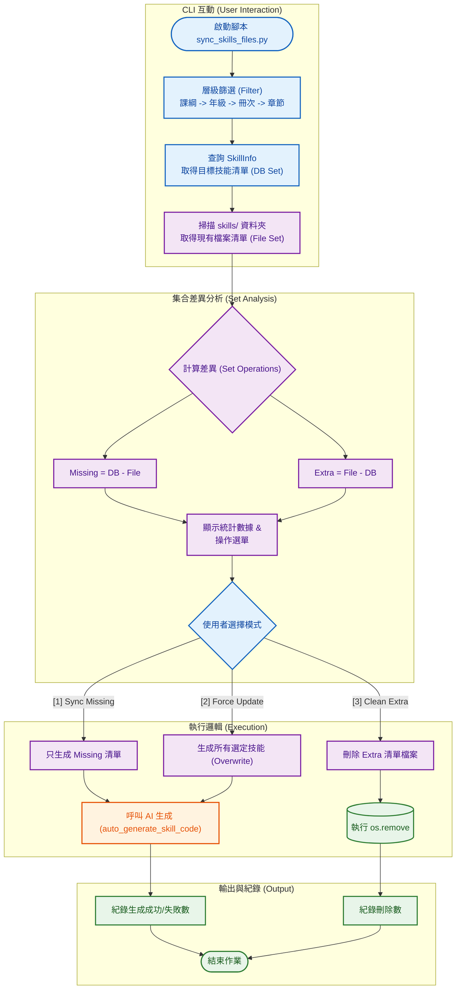

# 智學 Copilot 系統分析：技能代碼同步與生成系統 (Skill Code Sync & Gen)

**文件資訊**
* **版本**：1.2 (對應原始碼邏輯修正)
* **日期**：2025-12-07
* **文件狀態**：正式版
* **負責人**：Backend Engineer
* **對應程式碼**：`scripts/sync_skills_files.py`

---

## 1. 系統概述 (System Overview)

本系統負責維護「資料庫中的技能定義 (`SkillInfo`)」與「實體 Python 出題腳本 (`skills/*.py`)」之間的一致性。

透過互動式 CLI 介面，管理者可針對特定課綱、年級或章節進行精準篩選。系統會自動比對資料庫清單與檔案系統現狀，識別出「缺失的檔案 (Missing)」與「多餘的檔案 (Extra)」，並整合 Google Gemini AI 自動撰寫符合語法規範的出題程式碼，或協助清理廢棄腳本。

---

## 2. 系統架構與流程圖 (System Architecture)

本系統流程涵蓋「互動式篩選」、「檔案集合比對」、「AI 生成」與「檔案清理」四個階段。



---

## 3. 功能模組說明 (Functional Modules)

### 3.1 檔案差異比對 (Diff Analysis)
系統利用 Python 的集合 (Set) 運算來快速識別狀態：
* **Missing Files**: `{DB Skills} - {Existing Files}`。資料庫有定義，但還沒寫程式碼。
* **Extra Files**: `{Existing Files} - {DB Skills}`。資料庫已刪除或更名，但資料夾內還留著的廢棄程式碼（排除 `PROTECTED_FILES` 白名單）。

### 3.2 AI 代碼生成 (Code Generation)
* **核心呼叫**：透過 `core.code_generator.auto_generate_skill_code(skill_id)` 執行。
* **功能**：
    * 自動讀取 `SkillInfo` 的描述與題型設定。
    * 產生包含 `BaseQuestion` 繼承結構的 Python 代碼。
    * 內建 AST 語法檢查，確保生成的程式碼無語法錯誤。

---

## 4. 資料庫 Schema 關聯 (Database Schema)

| Table Name | 角色 | 關鍵欄位使用說明 |
| :--- | :--- | :--- |
| **SkillInfo** | **核心定義** | `skill_id`: 對應檔案名稱 (e.g., `G10_Poly.py`)。<br>`description`: AI 生成題目的依據。<br>`input_type`: 定義前端互動元件 (radio/text)。 |
| **SkillCurriculum** | **篩選索引** | `curriculum`, `grade`, `chapter`: 提供 CLI 的四層篩選條件。 |

---

## 5. 操作模式建議 (Operational Modes)

根據程式碼邏輯，系統提供三種操作模式：

| 模式名稱 | 邏輯判斷 | 適用情境 |
| :--- | :--- | :--- |
| **Sync Missing (預設)** | 僅處理 `Missing Set` 中的技能。 | **日常開發**。<br>快速補齊新匯入的技能腳本，不影響既有檔案。 |
| **Force Update (強制)** | 處理 `DB Set` 中的所有技能 (包含已存在的)。 | **架構升級**。<br>當 Prompt 邏輯更新或 Base Class 介面變更時，全面刷新代碼。 |
| **Clean Extra (清理)** | 僅處理 `Extra Set` 中的檔案。 | **維護與瘦身**。<br>刪除資料庫中已不存在的孤兒檔案 (Orphan Files)。 |

---

## 6. 實際操作與驗證 (Operation & Verification)

本節展示實際執行 `sync_skills_files.py` 的標準作業流程。

### 6.1 啟動與篩選
執行腳本後，系統會先列出四層篩選選單。

* **指令**：`python scripts/sync_skills_files.py`

**[CLI 互動範例]**
```text
(env) user@server:~$ python scripts/sync_skills_files.py

=== 啟動技能代碼同步系統 ===

[1/4] 請選擇課綱:
   [1] 普高 (general)
   [2] 國中 (junior)
👉 請選擇: 1

[2/4] 請選擇年級:
   [1] 10
   [2] 11
👉 請選擇: 1
... (略過冊次與章節選擇) ...
```

### 6.2 狀態報告與模式選擇
篩選完成後，系統會掃描 `skills/` 資料夾並顯示統計報告，接著詢問執行模式。

**[統計與選單範例]**
```text
--- 檔案狀態報告 ---
📂 掃描資料夾: ./skills
✅ 資料庫目標技能: 20 筆
📄 現有實體檔案: 18 筆
❌ 缺失檔案 (Missing): 3 筆  <- (資料庫有，檔案無)
🗑️ 多餘檔案 (Extra): 1 筆    <- (檔案有，資料庫無)

[請選擇操作模式]
   [1] Sync Missing (僅生成缺失的 3 個檔案)
   [2] Force Update (強制重新生成所有 20 個檔案)
   [3] Clean Extra (刪除多餘的 1 個檔案)
👉 請選擇 (輸入數字): 1
```

### 6.3 執行過程與結果
選擇模式後，系統會執行對應操作並顯示進度條。

**[情境 A：生成缺失檔案]**
```text
正在生成 3 個缺失檔案...
Generating: 100%|██████████| 3/3 [00:15<00:00, 5.02s/it]
   - skills/gh_poly_add.py ... ✅ OK
   - skills/gh_poly_sub.py ... ✅ OK
   - skills/gh_poly_mul.py ... ✅ OK
✅ 生成完成。成功: 3, 失敗: 0
```

**[情境 B：清理多餘檔案]**
```text
正在刪除 1 個多餘檔案...
Deleting: 100%|██████████| 1/1 [00:00<00:00, 100.00it/s]
   - 刪除 skills/old_unused_skill.py ... ✅ OK
✅ 清理完成。
```

### 6.4 驗證方法
1.  **檔案檢查**：進入 `skills/` 目錄，確認 `gh_poly_add.py` 等檔案已產生。
2.  **內容檢查**：打開生成的 `.py` 檔，確認包含 `class Question(BaseQuestion)` 且無語法錯誤。
3.  **運行測試**：執行前端或測試腳本，確認該題型可正常載入。