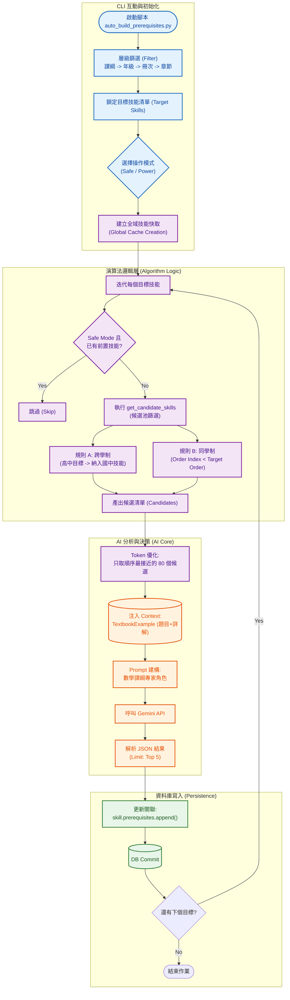

# 智學AIGC賦能平台 系統分析：前置技能自動建構系統 (Auto-Build Prerequisites)

**文件資訊**
* **版本**：1.2 (同步 Conetxt 注入與 Token 優化策略)
* **日期**：2025-12-22
* **文件狀態**：正式版
* **負責人**：Backend Engineer
* **對應程式碼**：`scripts/auto_build_prerequisites.py`

---

## 1. 系統概述 (System Overview)

本系統 (`auto_build_prerequisites.py`) 旨在利用 AI 語意分析能力，自動建構技能之間的 **依賴關係 (Dependencies)**，進而生成完整的學科 **知識圖譜 (Knowledge Graph)**。

透過分析技能描述與對應的例題，系統能判斷學習「目標技能 (Target Skill)」之前，學生必須先掌握哪些「前置技能 (Prerequisites)」。此系統解決了人工標註知識點關聯耗時且易有遺漏的問題，並具備識別跨學制依賴（如：高中技能依賴國中基礎）的邏輯能力。

---

## 2. 系統架構與流程圖 (System Architecture)

本系統流程涵蓋「互動篩選」、「全域快取建構」、「候選池演算法篩選」與「AI 語意分析」四個核心階段。



---

## 3. 功能模組說明 (Functional Modules)

### 3.1 階層式篩選 (Hierarchical Filtering)
為了解決批次處理的需求，系統採用標準的四層篩選機制 (`Curriculum` -> `Grade` -> `Volume` -> `Chapter`)，鎖定本次要構建前置關係的「目標技能群 (Target Skills)」。這允許管理者針對特定單元進行知識圖譜的局部更新。

### 3.2 候選技能池篩選 (`get_candidate_skills`)
這是本系統最關鍵的 **業務邏輯 (Business Logic)**。AI 無法從資料庫的所有技能中盲撈，必須由程式先根據學制規則篩選出「合法的候選人」，以確保生成的依賴關係符合教學邏輯。

* **全域快取 (Global Cache)**：
    * 在迴圈開始前，先將 `SkillInfo` 載入記憶體 (`all_skills_cache`)，避免 N+1 查詢效能問題。
* **跨學制規則 (Cross-Stage Rule)**：
    * 若目標技能屬於 **高中 (`gh_` 開頭)**，則所有 **國中 (`jh_` 開頭)** 技能自動成為候選。這確保了 AI 能識別出「高中多項式」依賴於「國中乘法公式」的跨階段關聯。
* **同級排序規則 (Sequence Rule)**：
    * 若兩者屬於同一學制（同為國中或同為高中），候選技能的 `order_index` 必須 **小於** 目標技能。
    * *目的*：防止產生「未來的技能是現在的基礎」這種邏輯謬誤（Circular Dependency Prevention）。

### 3.3 AI 判斷邏輯 (`identify_prerequisites`)
當候選名單準備好後，交由 LLM 進行語意分析。

* **Token 優化策略**：
    * 即便經過篩選，候選清單可能仍有數百個。程式強制截取 **順序最接近目標的 80 個技能** (`candidates_list[-80:]`) 傳送給 AI。
    * *效益*：大幅降低 API Token 消耗 (Cost Efficiency)，同時過濾掉與當前單元關聯度過低的遠古技能。
* **Context 注入 (Context Analysis Injection)**：
    * **核心技術**：從 `TextbookExample` 資料表撈取該技能的例題 (`Problem`) 與詳解 (`Solution`) 注入 Prompt。
    * *目的*：讓 AI 不僅看技能名稱（如「配方法」），更能分析**實際解題過程中的運算步驟**，進而精準判斷出隱性的基礎能力依賴（例如：解一元二次方程式時，步驟中用到了『完全平方公式』）。
* **輸出限制**：
    * **JSON Only**：強制 AI 回傳純 JSON 陣列。
    * **Top 5 Limit**：限制最多回傳 5 個最重要的前置技能，避免關聯圖過於雜亂。

---

## 4. 資料庫 Schema 關聯 (Database Schema)

本腳本主要操作 `SkillInfo` 的自我關聯 (Self-Referential Many-to-Many Relationship)。

| Table Name | 角色 | 關鍵互動說明 |
| :--- | :--- | :--- |
| **SkillInfo** | **核心實體** | 1. **Target**: 本次要分析的目標技能。<br>2. **Candidate**: 潛在的前置技能來源。<br>3. **Prerequisites**: 透過 `skill.prerequisites` 屬性維護多對多關聯表 (`skill_prerequisites` association table)。 |
| **TextbookExample** | **上下文輔助** | 提供 `problem_text` 與 `detailed_solution`，注入 Prompt 中協助 AI 理解該技能的實際應用場景。 |
| **SkillCurriculum** | **篩選索引** | 用於 CLI 初始階段的 `WHERE` 條件篩選，快速定位目標技能群。 |

* **Prerequisites 更新方式**：使用 SQLAlchemy 的關聯集合操作 `skill.prerequisites.append(prereq_skill)`，系統會自動在中間表 (`skill_prerequisites`) 插入對應的 FK 記錄。

---

## 5. 操作模式建議 (Operational Modes)

為了適應不同的維護場景，系統提供兩種執行模式：

| 模式名稱 | 邏輯判斷 | 適用情境 |
| :--- | :--- | :--- |
| **Safe Mode (預設)** | 檢查 `len(skill.prerequisites) > 0`。<br>**若已有前置技能則跳過**。 | **增量更新 (Incremental Update)**。<br>當匯入新章節時，只針對新技能分析前置關係，保留舊資料的人工修訂成果，避免不必要的 AI 消耗。 |
| **Power Mode (強制)** | 強制執行 `skill.prerequisites = []` 清空關聯，<br>**重新呼叫 AI 分析並寫入**。 | **重構知識圖譜 (Full Rebuild)**。<br>當發現舊有的關聯邏輯混亂，或更新了更強的 AI 模型 (如從 Gemini Pro 1.0 升級至 1.5) 時，用於全面刷新依賴關係。 |

---

## 6. 實際操作與驗證 (Operation & Verification)

本節展示實際執行 `auto_build_prerequisites.py` 的標準作業流程與預期輸出結果，供維運人員參考。

### 6.1 啟動與互動選單
執行腳本後，系統會依序詢問篩選條件，管理者應依照目標範圍輸入對應數字。

* **指令**：`python scripts/auto_build_prerequisites.py`

**[CLI 互動範例截圖位置]**
```text
(env) user@server:~$ python scripts/auto_build_prerequisites.py

=== 啟動前置技能構建系統 ===

[層級 1] 請選擇課綱:
   [0] ALL (全部處理)
   [1] 普高 (general)
   [2] 國中 (junior)
👉 請選擇 (輸入數字): 1

[層級 2] 請選擇年級:
   [1] 10
   [2] 11
   [3] 12
👉 請選擇 (輸入數字): 1
```

### 6.2 AI 分析進度 (Process Indicator)
進入分析階段後，系統會顯示 `tqdm` 進度條。若選擇 Safe Mode，系統會自動跳過已處理的項目。

**[執行進度範例截圖位置]**
```text
建立全域技能 Cache... 完成 (共 1520 筆)
鎖定目標技能: 25 筆

處理進度:  20%|███▌              | 5/25 [00:08<00:32, 1.6s/it]
Processing gh_poly_division... Found 2 prerequisites (jh_poly_add, jh_poly_mul).
Processing gh_quadratic_eq... Skipped (Already exists).
Processing gh_complex_num... Found 1 prerequisites (gh_real_num_property).
```

### 6.3 資料庫結果驗證 (Database Verification)
執行完成後，可透過 SQL 或 DB Client 工具檢查 `skill_prerequisites` 關聯表，確認依賴關係已成功建立。

**[資料庫查詢結果截圖位置]**
* **驗證 SQL 指令**：
```sql
SELECT 
    s.skill_id AS target_skill, 
    p.skill_id AS prerequisite_skill 
FROM skill_info s
JOIN skill_prerequisites sp ON s.skill_id = sp.skill_id
JOIN skill_info p ON sp.prerequisite_id = p.skill_id
WHERE s.skill_id = 'gh_poly_division';
```
* **預期結果**：
| target_skill | prerequisite_skill |
| :--- | :--- |
| `gh_poly_division` | `jh_poly_add` |
| `gh_poly_division` | `jh_poly_mul` |