# 系統分析文件：AI 提示詞補充系統 (Skill Enrichment System)

**文件資訊**
* **版本**：1.1 (新增操作驗證章節)
* **日期**：2025-12-07
* **文件狀態**：正式版
* **負責人**：Backend Engineer
* **對應程式碼**：`scripts/enrich_skills.py`

---

## 1. 系統概述 (System Overview)

本系統 (`enrich_skills.py`) 旨在為資料庫中的每個「技能單元 (`SkillInfo`)」自動生成高品質的 **引導式提問 (Suggested Prompts)**。

系統模擬「功文數學 (Kumon)」的輔導風格，透過 Google Gemini AI 分析資料庫中現有的標準例題，產出「精簡」、「觀察導向」且「不直接給答案」的三階段引導語。這些提示詞將被寫入資料庫，用於前端學生自學時的 AI 助教功能，協助學生在不依賴詳解的情況下，自行突破解題瓶頸。

---

## 2. 系統架構與流程圖 (System Architecture)

本系統流程涵蓋「互動式篩選」、「資料關聯提取」、「Prompt 建構與生成」以及「JSON 格式修復與寫入」四個階段。

```mermaid
graph TD
    %% --- 定義樣式 (Class Definitions) ---
    classDef userAction fill:#e3f2fd,stroke:#1565c0,stroke-width:2px,color:#0d47a1;
    classDef controller fill:#f3e5f5,stroke:#7b1fa2,stroke-width:2px,color:#4a148c;
    classDef aiCore fill:#fff3e0,stroke:#e65100,stroke-width:2px,color:#e65100;
    classDef dbData fill:#e8f5e9,stroke:#2e7d32,stroke-width:2px,color:#1b5e20;

    %% --- 1. CLI 用戶互動 (User Interaction) ---
    subgraph "CLI 互動與篩選 (Hierarchical Filtering)"
        direction TB
        Start(["啟動腳本 enrich_skills.py"]) --> FilterL1["層級 1: 選擇課綱 (Curriculum)"]
        FilterL1 --> FilterL2["層級 2: 選擇年級 (Grade)"]
        FilterL2 --> FilterL3["層級 3: 選擇冊次 (Volume)"]
        FilterL3 --> FilterL4["層級 4: 選擇章節 (Chapter)"]
        FilterL4 --> ModeSel{"選擇執行模式<br/>(Safe / Overwrite)"}
    end

    %% --- 2. 業務邏輯與資料存取 (Business Logic) ---
    subgraph "業務邏輯控制 (Controller)"
        direction TB
        ModeSel --> QuerySkills[("查詢 DB: 取得目標 Skill 清單")]
        QuerySkills --> LoopStart["迭代處理每個 Skill"]
        LoopStart --> CheckMode{"檢查模式與欄位狀態"}
        
        CheckMode -- "Safe Mode 且已有資料" --> Skip["跳過 (Skip)"]
        CheckMode -- "Overwrite 或 資料為空" --> FetchEx[("取得關聯例題<br/>TextbookExample (Limit 2)")]
    end

    %% --- 3. AI 生成核心 (AI Generator Core) ---
    subgraph "AI 生成與後處理 (AI Processing)"
        direction TB
        FetchEx --> BuildPrompt["Prompt 工程:<br/>Kumon 風格 + LaTeX 規則"]
        BuildPrompt --> CallAI["呼叫 Gemini API"]
        CallAI --> CleanText["移除 Markdown 標記"]
        CleanText --> FixJSON["Regex 修復:<br/>JSON 內 LaTeX 反斜線轉義"]
        FixJSON --> ParseJSON["JSON 解析 (Validation)"]
    end

    %% --- 4. 資料庫寫入 (Persistence) ---
    subgraph "資料庫存取 (Data Persistence)"
        direction TB
        ParseJSON --> UpdateObj["更新 SkillInfo 物件<br/>(prompt_1, 2, 3)"]
        UpdateObj --> CommitDB[("DB Commit")]
        CommitDB --> LoopEnd{"是否還有下個 Skill?"}
        LoopEnd -- "Yes" --> LoopStart
        LoopEnd -- "No" --> End(["結束作業"])
    end

    %% --- 套用樣式 ---
    class Start,FilterL1,FilterL2,FilterL3,FilterL4,ModeSel userAction;
    class QuerySkills,LoopStart,CheckMode,Skip,LoopEnd,End controller;
    class BuildPrompt,CallAI,CleanText,FixJSON,ParseJSON aiCore;
    class FetchEx,UpdateObj,CommitDB dbData;
```



---

## 3. 功能模組說明 (Functional Modules)

### 3.1 階層式篩選 (Hierarchical Filtering)
為解決資料庫中技能數量龐大、難以精準作業的問題，系統實作了四層連動篩選機制 (`get_user_selection`)。

* **技術實作**：使用 SQLAlchemy 的 `distinct` 查詢，動態從 `SkillCurriculum` 表中獲取當前存在的選項。
* **流程層級**：
    1.  **Curriculum** (例如：普高 / 國中 / 技高)
    2.  **Grade** (例如：10 / 11)
    3.  **Volume** (例如：數學1 / 數學2)
    4.  **Chapter** (例如：數與式 / 多項式)
* **批次處理**：每一層皆支援輸入 `0` 進行「全選 (Select All)」，允許管理者針對特定冊次或整年級進行批次生成。

### 3.2 AI 生成邏輯 (Generate Prompts)
核心函式 `generate_prompts` 負責將資料轉化為結構化的引導語。

* **Prompt 工程設計 (Kumon Style)**：
    * **角色設定 (Role)**：定義 AI 為「資深功文數學輔導員」，強調引導學生思考而非教學。
    * **指導原則 (Guidelines)**：
        * **極度精簡**：限制輸出在 **30 個字以內**，符合即時提示的需求。
        * **例題導向**：遇到問題先叫學生「回頭看例題找規律」。
        * **專注運算**：少講大道理，多提示「下一步的具體動作」。
    * **Few-Shot Learning**：將 `TextbookExample` 中的真實例題與詳解注入 Prompt，讓 AI 理解該技能的具體應用場景。

* **技術細節與容錯處理**：
    * **LaTeX 格式防護**：強制數學符號需用 `$` 包覆 (例如 `$x^2$`)。
    * **JSON 轉義修復 (Regex)**：
        * **問題**：LLM 生成的 JSON 字串中，LaTeX 的反斜線 (如 `\frac`, `\alpha`) 常導致 JSON 解析失敗 (因為 JSON 規範中 `\` 是跳脫字元)。
        * **解法**：在 `json.loads` 之前，執行正則表達式替換：
            ```python
            # 保護標準轉義符 (u, ", \, /, b, f, n, r, t)，其餘單反斜線強制轉為雙反斜線
            text = re.sub(r'\\(?![u"\\/bfnrt])', r'\\\\', text)
            ```
    * **結構化輸出**：要求 AI 僅回傳包含 `prompt_1`, `prompt_2`, `prompt_3` 的純 JSON 物件。

---

## 4. 資料庫 Schema 關聯 (Database Schema)

本腳本透過 ORM 操作多個資料表，以實現上下文獲取與資料回寫。

| Table Name | 角色 | 關鍵互動說明 |
| :--- | :--- | :--- |
| **SkillCurriculum** | **篩選索引** | 作為 **Source**。提供課綱、年級、章節的層級結構，用於 CLI 的 `WHERE` 條件篩選，找出需要處理的 `skill_id` 範圍。 |
| **TextbookExample** | **上下文提供者** | 作為 **Context**。系統會撈取該技能下的前 2 筆例題 (`limit(2)`)，包含 `problem_text` 與 `detailed_solution`，注入到 AI Prompt 中作為參考素材。 |
| **SkillInfo** | **目標儲存庫** | 作為 **Target**。AI 生成的結果將寫入以下三個欄位：<br>1. `suggested_prompt_1` (觀察例題)<br>2. `suggested_prompt_2` (關鍵步驟)<br>3. `suggested_prompt_3` (自我檢查) |

---

## 5. 操作模式建議 (Operational Modes)

為了平衡 API 成本與資料更新需求，系統提供兩種執行模式：

| 模式名稱 | 邏輯判斷 | 適用情境 |
| :--- | :--- | :--- |
| **Safe Mode (預設)** | 檢查 `skill.suggested_prompt_2` 是否為空字串或 None。<br>**若有內容則跳過 (Skip)**。 | **日常補遺**。<br>當資料庫中已有部分技能具備提示詞，只想針對「新匯入」或「漏掉」的技能進行補充時使用，可大幅節省 AI Token 消耗。 |
| **Overwrite All** | 不檢查現有資料，**強制呼叫 AI** 並覆蓋舊值。 | **提示詞優化 / 版本更新**。<br>當調整了 System Prompt (例如改變教學風格或長度限制) 後，需要全面刷新所有技能的引導語時使用。 |

---

## 6. 實際操作與驗證 (Operation & Verification)

本節展示實際執行 `enrich_skills.py` 的標準作業流程與預期輸出結果，供維運人員參考。

### 6.1 啟動與互動選單
執行腳本後，系統會依序詢問四層篩選條件，最後選擇執行模式。

* **指令**：`python scripts/enrich_skills.py`

**[CLI 互動範例截圖位置]**
```text
(env) user@server:~$ python scripts/enrich_skills.py

[1/4] 請選擇課綱:
   [1] 普高 (general)
   [2] 國中 (junior)
👉 請選擇: 1

[2/4] 請選擇年級:
   [1] 10
   [2] 11
👉 請選擇: 1

... (選擇冊次與章節) ...

[模式選擇]
   [1] Safe Mode (僅補充缺失, Default)
   [2] Overwrite All (強制覆蓋)
👉 請選擇: 1
```

### 6.2 AI 生成進度 (Process Indicator)
進入處理階段後，系統會顯示 `tqdm` 進度條。AI 生成每筆約需 2-3 秒，Safe Mode 下若資料已存在則會瞬間跳過。

**[執行進度範例截圖位置]**
```text
目標技能清單: 12 筆

處理進度:  25%|██▌              | 3/12 [00:05<00:15, 1.8s/it]
Processing skill: gh_log_basic... Generated. (提示: 觀察底數是否相同...)
Processing skill: gh_log_rule... Skipped (Already exists).
Processing skill: gh_exp_func... Generated. (提示: 代入 x=0 檢查...)
```

### 6.3 資料庫結果驗證 (Database Verification)
執行完成後，可透過 SQL 查詢 `SkillInfo` 表，確認 `suggested_prompt` 欄位已填入符合「Kumon 風格」的短句。

**[資料庫查詢結果截圖位置]**
* **驗證 SQL 指令**：
```sql
SELECT 
    skill_id, 
    suggested_prompt_1 AS 'Prompt 1 (觀察)', 
    suggested_prompt_2 AS 'Prompt 2 (步驟)' 
FROM skill_info 
WHERE skill_id = 'gh_log_basic';
```
* **預期結果**：
| skill_id | Prompt 1 (觀察) | Prompt 2 (步驟) |
| :--- | :--- | :--- |
| `gh_log_basic` | 仔細觀察例題中底數與真數的關係，你發現了什麼規律？ | 試著將對數形式轉換為指數形式，再計算看看。 |