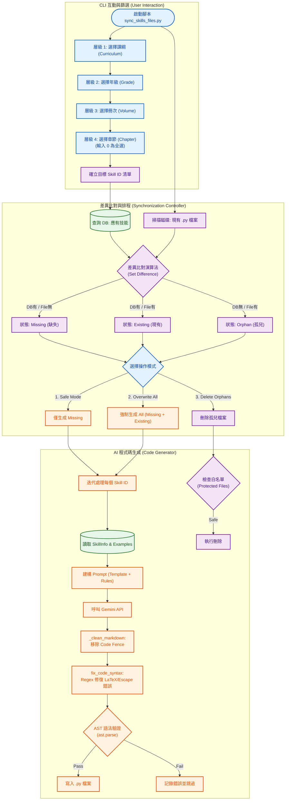

# 系統分析文件：技能代碼同步與生成系統 (Skill Code Sync & Gen)

**文件資訊**
* **版本**：1.0 (對應程式碼：`scripts/sync_skills_files.py`, `core/code_generator.py`)
* **日期**：2025-12-06
* **文件狀態**：正式版
* **負責人**：Backend Engineer

---

## 1. 系統概述 (System Overview)

本系統負責維護「資料庫中的技能定義 (`SkillInfo`)」與「實體 Python 出題腳本 (`skills/*.py`)」之間的一致性。透過互動式 CLI 介面，管理者可針對特定課綱、年級或章節進行精準篩選，系統自動執行檔案狀態檢測（差異比對），並整合生成式 AI (Gemini) 自動撰寫符合嚴格語法規範的出題程式碼，實現從資料定義到可執行腳本的自動化 DevOps 流程。

---

## 2. 系統架構與流程圖 (System Architecture)

本系統流程涵蓋互動式篩選、檔案差異分析、AI 生成與語法驗證四個階段。



---

## 3. 功能模組說明 (Functional Modules)

### 3.1 互動式篩選與差異比對 (CLI & Sync Logic)
位於 `scripts/sync_skills_files.py`，作為系統的入口控制器。
* **層級式篩選 (Hierarchical Filtering)**：
    * 採用 `distinct` 查詢，動態列出目前資料庫中存在的選項。
    * 支援輸入 `0` 進行「全選 (Select All)」，方便批次處理整冊或整年級的教材。
* **差異比對演算法 (Diff Algorithm)**：
    利用 Python 的集合運算 (`set`) 快速分類檔案狀態：
    * **Missing (需新增)**：$Set_{DB} - Set_{File}$。資料庫已定義，但缺少實體檔案。
    * **Existing (可更新)**：$Set_{DB} \cap Set_{File}$。兩邊皆有，可選擇是否由 AI 重新生成。
    * **Orphan (需清理)**：$Set_{File} - Set_{DB}$。資料庫已刪除，但實體檔案殘留。
* **安全保護機制 (Safety Guardrails)**：
    * **白名單保護**：內建 `PROTECTED_FILES` 集合 (如 `__init__.py`, `base_skill.py`)，防止在執行「刪除孤兒檔案」時誤刪系統關鍵組件。

### 3.2 AI 程式碼生成核心 (Code Generator)
位於 `core/code_generator.py`，負責生產高品質的 Python 代碼。
* **Prompt 建構策略**：
    * 動態讀取 `prompts/template.py`。
    * 將資料庫中的 `TextbookExample` (題目與詳解) 注入 Prompt 作為 Few-Shot Learning 的範例，確保 AI 理解出題邏輯。
* **後處理 Pipeline (Post-Processing)**：
    1.  **Markdown 清洗**：自動移除 LLM 常見的 ```python 包裹標記。
    2.  **語法修復 (`fix_code_syntax`)**：
        * **LaTeX 轉義**：將 `\sin`, `\alpha` 轉換為 Python 字串安全的 `\\sin`, `\\alpha`。
        * **F-string 修復**：處理 f-string 內部 `{}` 與 LaTeX `{}` 的衝突 (如集合符號)。
        * **Unicode 修正**：修復錯誤的 unicode escape sequence (如 `\u` 非法截斷)。
    3.  **AST 驗證 (`validate_python_code`)**：
        * 使用 Python 內建的 `ast.parse()` 嘗試解析生成的程式碼。
        * 若解析失敗，視為語法錯誤 (Syntax Error)，不會寫入檔案，避免壞檔導致系統崩潰。

---

## 4. 資料庫 Schema 關聯 (Database Schema)

本模組高度依賴資料庫定義來驅動生成流程。

| Table Name | 角色 | 關鍵欄位使用說明 |
| :--- | :--- | :--- |
| **SkillInfo** | **核心定義** | `skill_id`: 生成檔案的檔名依據 (e.g., `G10_Poly.py`)。<br>`description`: 提供給 AI 的題目背景描述。<br>`input_type`: 定義前端互動類型。 |
| **SkillCurriculum** | **篩選索引** | `curriculum`, `grade`, `volume`, `chapter`: 用於 CLI 的層級篩選查詢 (`WHERE` 條件)。<br>**Join 關係**: 與 `SkillInfo` 透過 `skill_id` 關聯。 |
| **TextbookExample** | **AI 範例庫** | `problem_text`: 原始題目 (LaTeX)。<br>`solution`: 詳解。<br>**用途**: 作為 Prompt 中的 Context，指導 AI 生成類似邏輯的 Python 變數與演算法。 |

---

## 5. 操作模式建議 (Operational Modes)

根據 `sync_skills_files.py` 的邏輯，建議以下操作場景：

| 模式名稱 | 適用場景 | 行為描述 |
| :--- | :--- | :--- |
| **Safe Mode (預設)** | 日常維運 | 僅生成 **Missing** 的檔案。適合剛匯入一批新教材，需要補齊程式碼時使用。不會覆蓋已修改過的現有檔案。 |
| **Overwrite All** | 版本升級 / Prompt 優化 | 強制重新生成篩選範圍內的所有檔案。適合當 System Prompt 或底層 `base_skill.py` 有重大更新，需要全面刷新程式碼時使用。 |
| **Delete Orphans** | 清潔系統 | 掃描並刪除不再被資料庫引用的 `.py` 檔案。建議在全域掃描模式下小心使用。 |