# 系統分析文件：AI 輔助教材分析與匯入系統
**版本**：前端 textbook_importer.html 後端 textbook_processor.py
**版本**：1.0  
**日期**：2025-12-06  
**文件狀態**：正式版  
**負責人**：System Architect

---

## 1. 系統概述 (System Overview)

本系統為一套「AI 輔助教材分析與匯入系統」，旨在自動化處理教學資源的數位化流程。系統透過前端介面接收使用者的教科書檔案（PDF/Word），經由後端進行光學字元辨識（OCR）、格式轉換與清洗，並整合 Google Gemini AI 進行內容結構化分析，最終將章節、技能點與例題存入資料庫，以支援後續的智慧教學應用。

---

## 2. 系統架構與流程圖 (System Architecture)

本系統採用分層架構設計，確保各模組職責分離。以下流程圖展示從「使用者上傳」到「資料持久化」的完整數據流向。

```mermaid
graph TD
    %% --- 定義樣式 (Class Definitions) ---
    classDef userAction fill:#e3f2fd,stroke:#1565c0,stroke-width:2px,color:#0d47a1;
    classDef systemProcess fill:#f3e5f5,stroke:#7b1fa2,stroke-width:2px,color:#4a148c;
    classDef dbData fill:#e8f5e9,stroke:#2e7d32,stroke-width:2px,color:#1b5e20;
    classDef extAPI fill:#fff3e0,stroke:#ef6c00,stroke-width:2px,stroke-dasharray: 5 5,color:#e65100;

    %% --- 1. 前端層 (Frontend Layer) ---
    subgraph "前端介面層 (User Interface)"
        direction TB
        Start(["使用者進入系統"]) --> SetMeta["設定 Metadata<br/>(課綱/出版社/年級/冊次)"]
        SetMeta --> ChooseMode{"選擇匯入模式"}
        ChooseMode -- "模式 A: 單一檔案" --> InputFile["上傳 .pdf / .docx"]
        ChooseMode -- "模式 B: 批次資料夾" --> InputFolder["上傳資料夾 (webkitdirectory)"]
        InputFile --> SkipCode["勾選: 是否跳過程式碼生成?"]
        InputFolder --> SkipCode
        SkipCode --> SubmitAction["點擊「開始分析」 (POST)"]
    end

    %% --- 2. 後端控制層 (Controller Layer) ---
    subgraph "後端路由與檢核 (Controller)"
        direction TB
        SubmitAction --> FlaskRoute["Flask 接收 Request"]
        FlaskRoute --> FilterName{"檔名過濾"}
        FilterName -- "開頭為 ~$" --> IgnoreFile(["忽略暫存檔"])
        FilterName -- "正常檔名" --> CheckExt{"副檔名分流"}
    end

    %% --- 3. 核心處理層 (Processing Layer) ---
    subgraph "核心處理層 (Core Processing)"
        direction TB
        %% PDF 分支
        CheckExt -- ".pdf" --> PyMuPDF["PyMuPDF: 提取純文字"]
        PyMuPDF --> PyTesseract["PyTesseract: 頁面截圖 OCR"]
        
        %% Word 分支
        CheckExt -- ".docx" --> Pypandoc["Pypandoc: 轉為 Markdown<br/>(保留 LaTeX)"]
        Pypandoc --> WandConvert["Wand: 向量圖 .wmf/.emf 轉 .png"]
        WandConvert --> ImgOCR["針對圖片執行 OCR"]
        ImgOCR --> CleanPandoc["clean_pandoc_output:<br/>清洗雙重上標/雜訊"]
        
        %% 匯流
        PyTesseract --> MergeData["整合文字與圖片內容"]
        CleanPandoc --> MergeData
    end

    %% --- 4. AI 服務層 (AI Service Layer) ---
    subgraph "AI 分析與結構化 (AI Service)"
        direction TB
        MergeData --> SelectPrompt["選擇 System Prompt<br/>(國中/普高/通用)"]
        SelectPrompt --> GeminiAPI["呼叫 Google Gemini API"]
        GeminiAPI --> SanitizeJSON["_sanitize_and_parse_json:<br/>修復 JSON 格式錯誤"]
        SanitizeJSON --> FixLaTeX["fix_common_latex_errors:<br/>修復數學符號 (sin -> \sin)"]
    end

    %% --- 5. 資料層 (Data Layer) ---
    subgraph "資料持久化 (Database)"
        direction TB
        FixLaTeX --> WriteDB[("寫入 SQLite/DB")]
        WriteDB --> Tbl_Skill[("SkillInfo 表")]
        WriteDB --> Tbl_Curriculum[("SkillCurriculum 表")]
        WriteDB --> Tbl_Example[("TextbookExample 表")]
    end

    %% --- 套用樣式 (Apply Styles) ---
    class Start,SetMeta,ChooseMode,InputFile,InputFolder,SkipCode,SubmitAction userAction;
    class FlaskRoute,FilterName,CheckExt,PyMuPDF,PyTesseract,Pypandoc,WandConvert,ImgOCR,CleanPandoc,MergeData,SelectPrompt,SanitizeJSON,FixLaTeX systemProcess;
    class WriteDB,Tbl_Skill,Tbl_Curriculum,Tbl_Example dbData;
    class GeminiAPI extAPI;
```

---

## 3. 前端設計說明 (Frontend Design)

前端頁面 `textbook_importer.html` 採用 **Bootstrap 5** 進行響應式佈局，並透過 **Vanilla JavaScript** 控制互動邏輯。

### 3.1 使用者輸入介面
* **Metadata 設定**：
    * **Curriculum** (Select)：選擇課綱（如：108課綱-普高、國中、技高）。
    * **Publisher** (Select)：選擇出版社（如：康軒、龍騰、翰林）。
    * **Grade** (Input)：輸入年級數字。
    * **Volume** (Input)：輸入冊次名稱（如：第一冊、數學3A）。
* **功能選項**：
    * **Skip Code Gen** (Checkbox)：允許使用者選擇是否跳過後續的 Python 題目產生程式碼生成步驟 (`auto_generate_skill_code`)，以加速匯入流程。

### 3.2 模式切換邏輯 (Mode Switching)
系統透過 JavaScript 監聽 Radio Button 事件，動態切換顯示區塊與驗證規則：
* **模式 A (Single File)**：
    * 顯示標準 `<input type="file" accept=".pdf,.docx">`。
    * 設定該欄位為 `required`，並隱藏資料夾輸入框。
* **模式 B (Batch Folder)**：
    * 顯示帶有 `webkitdirectory` 屬性的輸入框，允許選取整層資料夾。
    * 設定該欄位為 `required`，並隱藏單檔輸入框。
    * *技術細節*：利用 `style.display` 控制 DOM 元素的可視性，並即時清空非當前模式的 `value` 以避免送出多餘資料。

---

## 4. 後端處理邏輯 (Backend Logic)

後端核心 `textbook_processor.py` 基於 **Flask** 框架，針對不同檔案格式實作了差異化的 ETL 流程。

### 4.1 檔案前處理與分流
1.  **檔名過濾**：自動過濾以 `~$` 開頭的 Word 暫存檔，避免程式錯誤。
2.  **格式分流**：
    * **PDF 處理**：
        * 使用 `PyMuPDF (fitz)` 快速提取文字層。
        * 使用 `PyTesseract` 針對頁面截圖進行 OCR，以補全掃描檔或複雜排版中的遺漏文字。
    * **Word (.docx) 處理**：
        * 使用 `Pypandoc` 將文件轉換為 Markdown 格式，參數設定保留 LaTeX 公式結構。
        * **影像處理**：引入 `Wand` 將舊式向量圖 (`.wmf`, `.emf`) 轉換為 `.png`，解決 OCR 引擎不支援的問題。
        * **格式清洗 (`clean_pandoc_output`)**：使用 Regex 移除轉檔產生的雜訊（如雙重上標 `^`）並標準化行內公式邊界。

### 4.2 AI 分析與資料清洗
* **Prompt 工程**：根據使用者選擇的「課綱類型」動態載入對應的 System Prompt（例如：國中版強調主題拆分，普高版強調觀念整合）。
* **JSON 容錯解析 (`_sanitize_and_parse_json`)**：針對 LLM 常見的輸出錯誤（如 Markdown 標記殘留、引號未閉合）進行多階段修復與解析。
* **LaTeX 標準化 (`fix_common_latex_errors`)**：
    * 在寫入資料庫前，將非標準數學符號轉換為標準 LaTeX 語法。
    * *範例*：`sin x` $\rightarrow$ `\sin x`、`alpha` $\rightarrow$ `\alpha`、`>=` $\rightarrow$ `\geq`。

---

## 5. 資料庫 Schema 設計 (Database Schema)

系統使用 **SQLAlchemy ORM** 進行資料操作，核心實體關係如下：

### 5.1 核心資料表

| Table Name | 描述 | 關鍵欄位 (Columns) | 關聯性 (Relationships) |
| :--- | :--- | :--- | :--- |
| **SkillInfo** | **技能表** 定義最小知識單位 | `skill_id` (PK, String) `category` (String) `gemini_prompt` (Text) | 主表，被其他表參照 |
| **SkillCurriculum** | **課綱結構表** 定義技能在教材中的位置 | `id` (PK) `skill_id` (FK) `chapter` (String) `section` (String) `display_order` (Int) | 多對一 (Many-to-One) -> `SkillInfo` |
| **TextbookExample** | **例題表** 儲存教材內的題目與詳解 | `id` (PK) `skill_id` (FK) `problem_text` (Text, LaTeX) `solution` (Text) `difficulty` (Int) | 多對一 (Many-to-One) -> `SkillInfo` |

### 5.2 資料寫入策略
系統採用 **Transaction (交易)** 機制確保資料一致性：
1.  先建立或更新 `SkillInfo`。
2.  寫入 `SkillCurriculum` 建立章節對應。
3.  批次寫入 `TextbookExample`。
4.  若任一步驟失敗，則執行 `rollback` 回滾操作，確保資料庫不會殘留髒資料。