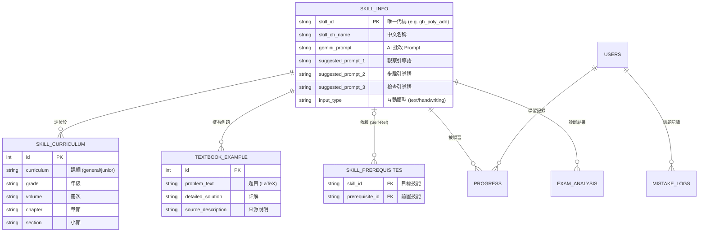

# 智學 Copilot (Smart-Edu Copilot) - 軟體設計文件 (SDD)

**版本**: 3.0 (整合全系統分析文件)
**日期**: 2025-12-10
**文件狀態**: 正式版

---

## 1. 系統概述 (System Overview)

### 1.1 專案背景與願景
本專案名為 **Smart-Edu Content Generator (SECG)**，即「智慧學習平台」。這是一個高度整合 **Generative AI (Google Gemini)** 與 **傳統數學教育理論** 的智慧校園解決方案。

系統的核心願景是解決高品質數位教材匱乏的痛點，透過自動化流水線 (Pipeline) 將傳統教科書轉化為結構化的智慧學習資產。同時，針對高中職數學弱勢學生，提供一對一、適性化、且具備「蘇格拉底式引導」能力的 AI 數位家教。

### 1.2 核心價值主張
1.  **自動化內容生成**: 從 PDF/Word 到 Python 演算法題庫，實現「題目即程式 (Code as Content)」。
2.  **知識圖譜驅動**: 自動分析並建構由國中至高中的跨學制技能依賴網絡，精準診斷學習斷點。
3.  **多模態互動學習**: 結合動態圖形 (Dynamic Visualization)、手寫辨識 (OCR) 與 AI 對話，提供沉浸式學習體驗。
4.  **人機協作 (Human-in-the-loop)**: 提供完善的前後台校正介面，確保 AI 生成內容的正確性與教學品質。

---

## 2. 系統架構設計 (System Architecture)

本系統採用 **流水線 (Pipeline) 式** 架構，資料從原始檔案流向資料庫，再經由多個 AI 模組處理，最終服務於前端應用。

### 2.1 高層架構圖

```mermaid
graph TD
    %% 定義分層
    subgraph Data_Source [資料來源層]
        RawFiles[教科書 PDF/Word]
        Config[課綱設定檔]
    end

    subgraph Core_Pipeline [AI 核心處理流水線]
        direction TB
        Importer[模組 1: 教材數位化引擎<br>(OCR + 結構提取)]
        Sync[模組 2: 題庫自動程式化<br>(Python Code Gen)]
        Enrich[模組 3: 教學引導增強<br>(Socratic Prompt Gen)]
        Graph[模組 4: 知識圖譜建構<br>(Dependency Analysis)]
    end

    subgraph Backend_Services [後端服務層]
        FlaskAPI[Flask Web API]
        AIService[Gemini AI 整合服務]
        DB[(SQLite/Relational DB)]
        FileSystem[技能模組代碼庫 skills/*.py]
    end

    subgraph Frontend_Apps [前端應用層]
        PracticeUI[智慧適性化練習介面]
        AdminConsole[後台管理控制台]
        TeacherDash[教師儀表板]
    end

    %% 資料流
    Data_Source --> Importer
    Importer --> DB
    DB <--> Sync
    Sync --> FileSystem
    DB <--> Enrich
    DB <--> Graph
    
    flaskAPI <--> DB
    flaskAPI <--> FileSystem
    flaskAPI <--> AIService
    
    Frontend_Apps <--> FlaskAPI
```

### 2.2 技術堆疊 (Tech Stack)

| 領域 | 技術/工具 | 用途說明 |
| :--- | :--- | :--- |
| **後端框架** | **Flask 2.0+** | 輕量級 Web 框架，負責 API 路由與業務邏輯。 |
| **資料庫** | **SQLite** (開發) / **SQLAlchemy** | 關聯式資料庫與 ORM，維護核心數據結構。 |
| **AI 引擎** | **Google Gemini API** (Pro/Vision) | 核心大腦，負責 OCR、語意理解、代碼生成、圖譜分析。 |
| **文件處理** | **PyMuPDF, PyTesseract, Pypandoc, Wand** | 處理 PDF, Word, 圖片 OCR 與格式轉換。 |
| **前端技術** | **HTML5, Bootstrap 5, Vanilla JS** | 響應式介面，強調操作流暢度。 |
| **數學渲染** | **MathJax 3.x** | 前端高品質 LaTeX 數學公式渲染。 |
| **互動元件** | **SweetAlert2, Select2** | 優化前端使用者體驗 (UX)。 |

---

## 3. 資料庫設計 (Database Schema)

系統資料庫設計圍繞著 **「技能 (Skill)」** 這一核心實體展開，向外延伸出課程結構、實作代碼、依賴關係與學生數據。

### 3.1 核心實體關係圖 (ERD)



---

## 4. 詳細操作流程與體驗 (Detailed Operational Flows)

本節將詳細說明不同角色在系統中的操作流程，涵蓋從教材匯入到學生練習的完整生命週期。

### 4.1 管理員：教材匯入與處理流水線 (Admin Pipeline)

這是系統最核心的**自動化內容生成**流程，分為四個階段：

#### 階段 1：教材數位化 (Textbook Digitizer)
*   **入口**：`/textbook_importer.html`
*   **操作**：上傳 PDF 或 Word 課本，設定 Metadata (課綱、年級)。
*   **AI 技術**：
    *   **混合 OCR**：結合 PyTesseract (圖) 與 PyMuPDF (文)，並利用 Wand 處理 Word 向量圖。
    *   **結構分析**：Gemini 分析章節標題與例題，修復 JSON 格式與 LaTeX 語法錯誤。
*   **產出**：寫入 `SkillInfo`, `SkillCurriculum`, `TextbookExample` 資料表。

#### 階段 2：維護與校正 (Maintenance & Cleaning)
在生成程式碼前，必須進行人工校正，確保品質。
*   **課程結構校正** (`/admin_curriculum.html`)：透過四層連動選單，修正 AI 誤判的章節層級。
*   **例題清洗** (`/admin_examples.html`)：使用 MathJax 預覽例題，修正 OCR 錯誤 (如 `x2` -> `$x^2$`)，剔除廣告或無意義文字。

#### 階段 3：資產生成 (Asset Generation)
此階段將靜態資料轉化為動態資產。
*   **題庫程式化** (`sync_skills_files.py` / `/admin_skills.html`)：
    *   比對資料庫與檔案系統，找出 `Missing` 的技能。
    *   **AI Code Gen**：讀取 `SkillInfo` 描述與 `TextbookExample`，自動撰寫含 AST 語法驗證的 Python 出題腳本 (`skills/*.py`)。
*   **教學引導增強** (`enrich_skills.py`)：
    *   **Few-Shot Learning**：AI 參考例題詳解，生成三階段「蘇格拉底式」引導語 (觀察 -> 步驟 -> 檢查)，寫入 `SkillInfo`。

#### 階段 4：知識圖譜建構 (Graph Building)
*   **工具**：`auto_build_prerequisites.py` / `/admin_prerequisites.html`
*   **邏輯**：AI 分析技能間的依賴關係，並結合「跨學制規則」(高中依賴國中) 與「順序規則」。
*   **產出**：寫入 `skill_prerequisites` 關聯表，並可透過前台介面進行人工圖譜微調。

### 4.2 重點特色：智慧適性化練習介面 (Intelligent Adaptive Practice Interface)

本介面是學生與 AI 互動的核心場域，設計上強調 **「多模態互動 (Multi-modal Interaction)」** 與 **「即時上下文感知 (Real-time Context Awareness)」**。系統打破了傳統鍵盤輸入的限制，支援跨平台（桌機、平板、手機）瀏覽器操作，無須安裝 App 即可使用。

#### 1. 即時 AI 互動與上下文感知
AI 助教不再是與題目脫節的聊天機器人，而是能「看見」學生當前正在解哪一道題：
*   **Context Injection**: 當學生發問時，系統會自動打包「當前題目參數 (Question Parameters)」、「動態圖形狀態 (Graph State)」與「正確詳解」傳送給 AI。
*   **即時回饋 (Real-time Feedback)**: 學生每一步驟的邏輯（透過對話或作答）都能獲得 AI 的即時檢核。AI 會針對學生的思路提供引導，而非直接給出答案。
*   **預測性引導 (Predictive Prompts)**: 系統會根據 AI 的分析，動態生成「接下來你可能會問...」的提示按鈕 (Chips)，例如「提示第一步」、「幫我畫圖」或「檢查我的假設」，降低學生提問的門檻。

#### 2. 多模態輸入與作圖題判斷
系統支援多種直觀的作答方式，特別針對數學科的特性進行了強化：
*   **手寫辨識 (Handwriting)**: 內建 HTML5 Canvas 繪圖板，學生可直接在螢幕上列式計算。系統將筆跡轉為圖片後，透過 Vision API 進行語意分析。
*   **智慧作圖判斷 (AI Drawing Analysis)**: 
    *   針對 **「作圖題」** (如：畫出二次函數圖形、標示向量)，學生在 Canvas 上繪圖後，AI 能視覺化判斷圖形的特徵（開口方向、頂點位置、截距）是否正確。
    *   這突破了傳統電腦閱卷無法批改作圖題的限制。
*   **語音輸入**: (未來擴充) 支援語音轉文字 (STT)，讓學生能用「說」的來提問。

#### 3. 深度錯誤節點分析 (Deep Error Node Analysis)
AI 的批改不只給出「對/錯」，而是進行深度的歸因分析：
*   **錯誤節點定位**: AI 會分析學生的計算過程，精確指出是哪一個邏輯節點 (Node) 出錯 (例如：「在移項變號時出錯」或「微分公式帶錯」)。
*   **記錄與追蹤**: 每個錯誤節點都會被記錄到 `Mistake Logs` 資料庫。
*   **弱點分析**: 系統累積數據後，能分析出學生的「常犯錯誤類型」 (如：粗心計算 vs. 核心觀念不懂)，並據此調整後續的推題策略。

#### 4. 跨平台無障礙存取 (Cross-Platform Accessibility)
*   **Browser-based**: 採用標準 Web 技術 (HTML5/Project Fugu)，只要有瀏覽器即可使用。
*   **RWD 設計**: 介面自動適應桌機與平板 (iPad/Android Tablet) 解析度，在觸控裝置上提供最佳的手寫體驗。

#### 模式 2：考卷診斷與補救 (Exam Diagnosis)
*   **操作**：上傳考卷照片。
*   **AI 診斷**：
    *   OCR 辨識題目與學生筆跡。
    *   判斷錯誤類型 (計算/觀念)。
    *   對應至 `skills_info`，找出弱點技能。
*   **補救路徑**：系統根據 `skill_prerequisites` 圖譜，建議學生「先回去練習某個國中基礎技能」。

---

## 5. 關鍵 AI 互動技術 (Key AI Interactions)

本系統與 AI 的整合是深度的、結構化的，而非僅僅串接 Chatbot API。

### 5.1 手寫辨識與智慧批改 (Vision Pipeline)
*   **場景**：學生上傳計算過程圖片。
*   **技術**：Gemini Vision API。
*   **Prompt 策略**：角色扮演 (耐心家教)，要求輸出 JSON 格式 (是否正確、錯誤類型、Markdown 建議)。
*   **特色**：能辨識潦草字跡，並指出具體是「第幾行」開始出錯。

### 5.2 題庫程式碼生成 (Code Gen Pipeline)
*   **場景**：`sync_skills_files.py`。
*   **挑戰**：如何讓 AI 寫出可執行的 Python 代碼？
*   **解決方案**：
    1.  **Context 注入**：將該技能的「標準例題」做為 Few-Shot 範例。
    2.  **AST 驗證**：後端即時解析生成的程式碼語法樹，若有 Syntax Error 則自動重試。
    3.  **模板繼承**：強制 AI 繼承 `BaseQuestion` 類別，確保介面統一 (generate/check 方法)。

### 5.3 知識圖譜依賴分析 (Semantic Dependency)
*   **場景**：`auto_build_prerequisites.py`。
*   **演算法**：
    1.  **候選池篩選**：先用程式邏輯 (跨學制/順序) 篩出 80 個候選技能。
    2.  **語意分析**：AI 閱讀目標技能的「詳解步驟」，判斷解題過程中用到了哪些候選技能的觀念。
    3.  **Token 優化**：精簡輸入資料，確保在 Token 限制內完成高精度分析。

### 5.4 蘇格拉底式教學引導 (Socratic Tutoring)
*   **場景**：`enrich_skills.py` 與 前端 Chatbot。
*   **風格**：Kumon 式輔導。
*   **限制**：嚴格禁止直接給出數字答案。
*   **三階段引導**：
    1.  **觀察 (Observe)**：引導學生發現題目規律。
    2.  **步驟 (Steps)**：提示關鍵的第一步。
    3.  **檢查 (Check)**：反思答案合理性。

---

## 6. 部署與維護 (Deployment & Maintenance)

### 6.1 環境需求
*   **OS**: Windows / Linux
*   **Python**: 3.9+
*   **API Key**: Google Gemini API Key

### 6.2 初始化步驟
1.  **建立虛擬環境**: `python -m venv .venv`
2.  **安裝依賴**: `pip install -r requirements.txt`
3.  **設定環境變數**: `.env` (含 `GEMINI_API_KEY`, `SECRET_KEY`)
4.  **初始化資料庫**: `python utils/init_db.py`

### 6.3 運維腳本 (Scripts)
*   `scripts/import_data.py`: 匯入初始種子資料。
*   `scripts/sync_skills_files.py`: 同步與修復題庫程式碼 (日常使用)。
*   `scripts/auto_build_prerequisites.py`: 重建知識圖譜 (架構調整時使用)。
*   `scripts/enrich_skills.py`: 批量優化 AI 引導語。

---

## 7. 結語

**Smart-Edu Content Generator** 透過模組化的 AI 流水線，成功將教科書數位化的邊際成本降至最低，並將「適性化學習」提升至知識圖譜與代碼生成的高度。這不僅是一個學習平台，更是一個永續累積的教育智慧資產庫。